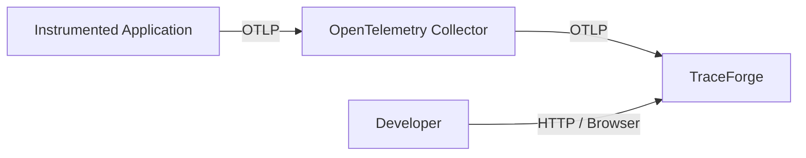
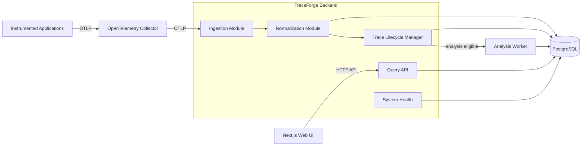
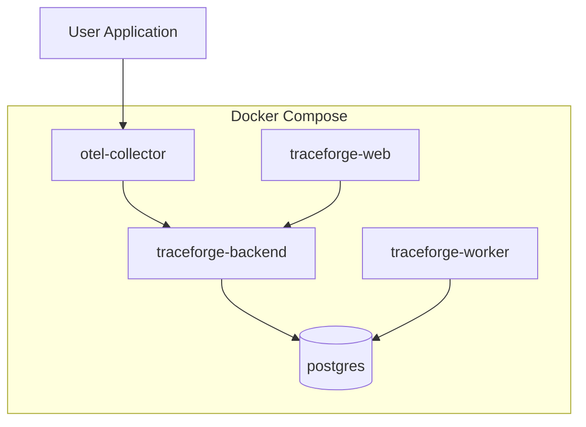
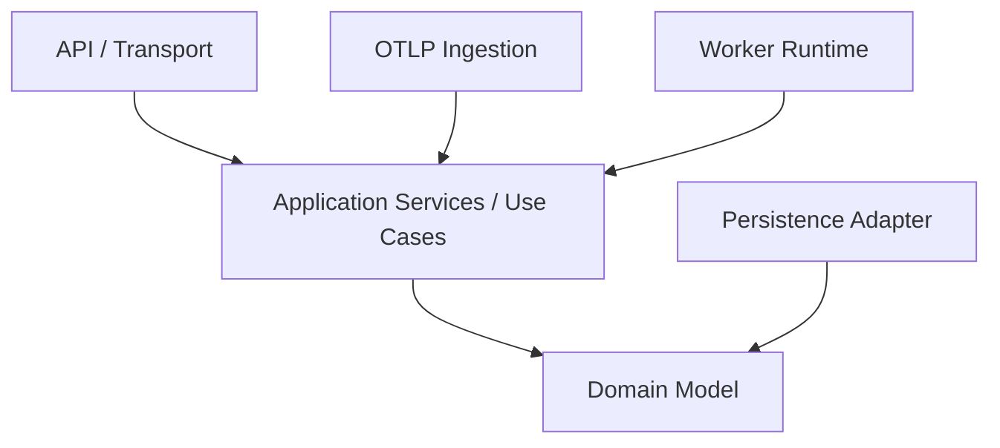

# 9. System Architecture

## 9.1 Purpose

This section defines the high-level architecture of TraceForge v0.1.

The architecture must support the product requirements established in previous sections while remaining proportionate to the intended deployment environment.

The design should provide clear separation between:

* telemetry reception;
* trace persistence;
* trace lifecycle management;
* diagnostic analysis;
* query operations;
* user interaction.

At the same time, TraceForge SHOULD avoid introducing distributed-system complexity that is not required by the initial product.

The architecture therefore follows the principle:

> **Separate responsibilities logically first, and physically only when there is a concrete operational reason to do so.**

TraceForge observes distributed systems.

TraceForge itself does not need to become an unnecessarily distributed system.

---

## 9.2 Architectural Goals

The v0.1 architecture SHALL prioritize:

```text
correctness
    ↓
clear component responsibilities
    ↓
evidence integrity
    ↓
testability
    ↓
operational simplicity
    ↓
performance
    ↓
future scalability
```

This ordering intentionally favors a design that is understandable and reliable over one optimized for hypothetical enterprise workloads.

The architecture should make it possible to answer:

```text
Where does telemetry enter?

Where is canonical telemetry stored?

When is a trace considered ready for analysis?

Who executes analysis?

Where are findings stored?

How does the frontend retrieve data?

What happens when any of these stages fail?
```

Each question should have one clear architectural owner.

---

## 9.3 System Context

At the highest level, TraceForge interacts with three external actors:

```text
Instrumented Application
OpenTelemetry Collector
Developer
```

The conceptual system context is:



TraceForge therefore exposes two fundamentally different interfaces:

```text
machine-facing telemetry ingestion
```

and:

```text
developer-facing application API / UI
```

These interfaces have different performance, validation, and failure characteristics and SHOULD remain logically separated.

---

## 9.4 Proposed v0.1 Architecture

The proposed v0.1 architecture consists of the following major components:

```text
OpenTelemetry Collector

TraceForge Backend
    ├── Ingestion Module
    ├── Normalization Module
    ├── Trace Lifecycle Module
    ├── Query API
    ├── Analysis Orchestrator
    └── System Health Module

Analysis Worker
    └── Diagnostic Detectors

PostgreSQL

TraceForge Web UI
```

The corresponding architecture is:



This architecture represents **logical responsibility boundaries**.

Not every box must correspond to an independently deployed network service.

---

## 9.5 Deployment Topology

The initial deployment SHALL remain small.

A representative Docker Compose deployment is expected to contain:

```text
traceforge-web
traceforge-backend
traceforge-worker
postgres
otel-collector
```

Conceptually:



This gives TraceForge only a small number of runtime processes while still preserving useful isolation between:

```text
interactive API workload
```

and:

```text
background diagnostic analysis
```

---

## 9.6 OpenTelemetry Collector

### 9.6.1 Responsibility

TraceForge SHALL use the official OpenTelemetry Collector as the preferred telemetry-facing edge component.

The Collector is responsible for receiving telemetry from instrumented applications and forwarding compatible trace telemetry to TraceForge.

The expected flow is:

```text
Application
    ↓
OpenTelemetry SDK
    ↓
OTLP
    ↓
OpenTelemetry Collector
    ↓
OTLP
    ↓
TraceForge
```

---

### 9.6.2 Why TraceForge Does Not Replace the Collector

TraceForge is not intended to implement a proprietary telemetry agent or general telemetry routing system.

The OpenTelemetry Collector already provides established capabilities such as:

* OTLP reception;
* batching;
* retry behaviour;
* transport configuration;
* exporter pipelines;
* telemetry routing.

Reimplementing these capabilities would add substantial complexity without improving TraceForge's core diagnostic value.

TraceForge should focus on:

> interpreting telemetry

rather than:

> reinventing telemetry transport infrastructure.

---

### 9.6.3 Direct Application Export

Direct export may remain possible:

```text
Application
    ↓
TraceForge
```

provided the application exports compatible OTLP telemetry.

However, the Collector SHOULD remain the documented default deployment model.

This gives the user a standard telemetry architecture and avoids making TraceForge-specific configuration the primary path.

---

## 9.7 TraceForge Backend

The TraceForge Backend acts as the primary application server.

It is responsible for:

```text
receiving normalized telemetry input
persisting canonical telemetry
managing trace lifecycle state
exposing query APIs
exposing system state
coordinating analysis scheduling
```

The backend SHALL initially be implemented as a **modular application**, not as multiple independent microservices.

A conceptual module structure is:

```text
traceforge-backend
│
├── ingestion
├── normalization
├── traces
├── spans
├── services
├── findings
├── analysis
├── system
└── persistence
```

The exact package structure may differ.

The important requirement is that the responsibilities remain explicit.

---

## 9.8 Ingestion Module

### 9.8.1 Responsibility

The Ingestion Module is the boundary between external telemetry and TraceForge's internal model.

Its responsibilities include:

```text
accept OTLP trace data
        ↓
perform protocol-level validation
        ↓
convert transport representation
        ↓
pass valid telemetry to normalization
        ↓
return appropriate ingestion response
```

The ingestion module SHALL NOT perform heavy diagnostic analysis.

---

### 9.8.2 Ingestion Must Remain Fast

The ingestion path should perform only work required to safely accept and persist telemetry.

It SHOULD NOT synchronously:

* calculate critical paths;
* detect repeated operations;
* generate findings;
* construct expensive aggregate views.

The desired path is approximately:

```text
receive
    ↓
validate
    ↓
normalize
    ↓
persist
    ↓
acknowledge
```

This prevents analysis workload from increasing telemetry delivery latency.

---

### 9.8.3 Partial Failure

Where protocol semantics allow it, malformed telemetry SHOULD be isolated from valid telemetry.

One invalid span SHOULD NOT unnecessarily prevent unrelated valid spans in the same batch from being accepted.

The exact rejection semantics will be defined in the ingestion design.

---

## 9.9 Normalization Module

The Normalization Module converts incoming telemetry into a stable internal representation.

This boundary is important because TraceForge SHOULD NOT spread direct knowledge of OTLP protobuf structures throughout the codebase.

The intended transformation is:

```text
OTLP transport object
        ↓
Normalization Module
        ↓
Canonical TraceForge span representation
```

---

### 9.9.1 Responsibilities

Normalization may include:

* identifier conversion;
* timestamp conversion;
* service identity extraction;
* semantic attribute mapping;
* error observation extraction;
* operation classification;
* safe representation of attributes and events.

Normalization SHALL NOT produce diagnostic findings.

---

### 9.9.2 Why Normalization Is a Separate Layer

Without a normalization boundary, downstream code could become tightly coupled to:

```text
protobuf field names
OTLP transport structures
specific OpenTelemetry semantic-convention versions
```

This would make:

* analysis harder to test;
* semantic-convention changes harder to support;
* synthetic fixtures more difficult to create.

The analysis engine should ideally consume TraceForge domain objects rather than OTLP protocol objects.

---

## 9.10 Persistence Layer

PostgreSQL SHALL be the initial persistence technology for TraceForge v0.1.

The database stores both:

```text
canonical telemetry
```

and:

```text
derived TraceForge data
```

while maintaining a clear conceptual distinction between them.

Examples of canonical data include:

```text
spans
attributes
events
resource metadata
```

Examples of derived data include:

```text
trace metadata
normalized operations
analysis runs
findings
evidence
service dependencies
```

The exact schema will be defined in the storage-design section.

---

## 9.11 Why PostgreSQL Is the Initial Storage System

The initial product does not require a specialized high-volume telemetry database.

PostgreSQL provides:

* strong transactional semantics;
* mature indexing;
* relational modeling;
* JSON support;
* broad tooling;
* simple local deployment;
* excellent developer familiarity;
* straightforward migrations.

For the intended v0.1 workload, this provides a better complexity-to-capability ratio than introducing a specialized analytics database immediately.

TraceForge SHALL define measurable conditions under which PostgreSQL would become insufficient rather than assuming that failure in advance.

---

## 9.12 Trace Lifecycle Manager

The Trace Lifecycle Manager is responsible for determining the current lifecycle state of traces.

Its responsibilities include:

```text
observe span arrival
        ↓
update trace metadata
        ↓
detect known structural issues
        ↓
determine whether more spans may arrive
        ↓
transition trace state
        ↓
schedule analysis when appropriate
```

This module exists because:

> receiving a span

is not equivalent to:

> receiving a complete trace.

---

### 9.12.1 Trace State Ownership

The lifecycle manager owns transitions such as:

```text
PROCESSING
    ↓
COMPLETE
```

or:

```text
PROCESSING
    ↓
INCOMPLETE
```

The exact completion algorithm is still unresolved and will be defined during data-flow design.

---

### 9.12.2 Late Span Handling

If a span arrives after initial analysis:

```text
trace analyzed
    ↓
late span arrives
    ↓
trace state changes
    ↓
re-analysis may become necessary
```

The lifecycle manager SHALL be responsible for determining whether the existing analysis is now stale.

---

## 9.13 Analysis Scheduling

Analysis SHALL be asynchronous relative to telemetry ingestion.

The ingestion request SHOULD NOT wait for diagnostic analysis to complete.

The flow is:

```text
span persisted
    ↓
trace becomes analysis-eligible
    ↓
analysis work scheduled
    ↓
ingestion continues independently
```

This provides several advantages:

* ingestion remains predictable;
* expensive detectors do not block telemetry receipt;
* analysis failures do not become ingestion failures;
* worker concurrency can be controlled separately.

---

## 9.14 Analysis Worker

The Analysis Worker executes diagnostic analysis outside the interactive backend request path.

Its primary responsibilities are:

```text
receive analysis task
        ↓
load required trace data
        ↓
execute eligible detectors
        ↓
persist detector results
        ↓
persist findings
        ↓
update analysis state
```

---

### 9.14.1 Why a Separate Worker Process

A separate worker is justified even in v0.1 because analysis workload differs from API workload.

Analysis may involve:

* sorting spans;
* interval calculations;
* SQL normalization;
* graph traversal;
* critical-path calculation;
* grouping operations;
* error propagation reasoning.

These operations may become CPU-heavy relative to simple API requests.

Separating the worker protects interactive requests from diagnostic workload.

---

### 9.14.2 Shared Codebase

The worker SHOULD initially share the backend codebase.

For example:

```text
backend/
├── app/
│   ├── domain/
│   ├── persistence/
│   ├── analysis/
│   └── ...
│
├── api_entrypoint.py
└── worker_entrypoint.py
```

This gives physical process separation without creating two independently versioned projects.

---

## 9.15 Analysis Work Queue

TraceForge requires a mechanism for communicating:

```text
trace X requires analysis
```

from the lifecycle manager to the worker.

However, v0.1 SHOULD avoid introducing Kafka, RabbitMQ, or another dedicated broker unless necessary.

The preferred initial design is a **database-backed analysis queue**.

Conceptually:

```text
analysis_jobs

job_id
trace_id
state
attempt_count
created_at
available_at
started_at
completed_at
```

The worker claims pending jobs from PostgreSQL.

---

### 9.15.1 Why a Database-Backed Queue

For the target workload, this provides:

* durability;
* simple deployment;
* transactional scheduling;
* restart recovery;
* observability;
* no additional infrastructure service.

It also allows the backend to persist:

```text
trace becomes eligible
```

and:

```text
analysis job created
```

within a safe transactional workflow.

---

### 9.15.2 When a Dedicated Broker Would Be Justified

A dedicated queue MAY become appropriate if measurements demonstrate problems such as:

* analysis throughput exceeding database-backed scheduling capacity;
* large worker fleets;
* complex delivery semantics;
* substantial contention on PostgreSQL;
* multiple independent task categories requiring more sophisticated routing.

Until such a requirement exists, an external broker adds unnecessary operational complexity.

---

## 9.16 Detector Architecture

The worker SHALL execute diagnostic detectors through a common interface.

Conceptually:

```text
Analysis Worker
│
├── CriticalPathDetector
├── LatencyContributorDetector
├── RepeatedDatabaseOperationDetector
├── ErrorOriginDetector
└── future detectors
```

Each detector SHOULD be independently testable.

A conceptual contract is:

```text
Detector
    ↓
eligibility(trace)
    ↓
analyze(trace)
    ↓
DetectorResult
```

A detector SHALL produce one of:

```text
findings
no findings
insufficient data
failure
```

These outcomes SHALL remain distinct.

---

## 9.17 Analysis Orchestrator

The Analysis Orchestrator coordinates detector execution for a trace.

Its responsibilities include:

```text
load trace
        ↓
determine eligible detectors
        ↓
execute detectors
        ↓
collect results
        ↓
persist AnalysisRun
        ↓
update analysis state
```

The orchestrator SHALL NOT contain detector-specific diagnostic logic.

For example:

```text
Repeated database detection
```

belongs in its detector.

The orchestrator only manages execution.

---

## 9.18 Query API

The Query API provides developer-facing access to TraceForge data.

It is responsible for operations such as:

```text
list traces
retrieve trace
retrieve spans
list services
retrieve service dependencies
retrieve findings
retrieve system health
```

The API SHALL read canonical and derived data but SHALL NOT modify incoming telemetry.

---

### 9.18.1 Separation from Ingestion API

Telemetry ingestion and developer queries MAY be hosted by the same backend process in v0.1.

However, they SHALL remain separate logical modules and route groups.

For example:

```text
/v1/otlp/...
```

and:

```text
/api/traces
/api/services
/api/findings
```

are conceptually different interfaces.

The exact paths will be defined in the API section.

---

### 9.18.2 Why They Remain One Process Initially

Separating ingestion and query into independent deployed services would introduce:

* additional container;
* additional health management;
* additional internal API boundaries;
* additional deployment configuration.

The v0.1 workload does not yet justify this cost.

Logical separation preserves the ability to split them later if ingestion throughput begins to interfere with query latency.

---

## 9.19 TraceForge Web UI

The Web UI is the primary developer-facing interface.

It is responsible for presentation and interaction, not diagnostic interpretation.

The UI SHOULD receive already structured information such as:

```text
TraceSummary
TraceDetail
Finding
Service
Dependency
```

rather than reimplementing analysis logic in TypeScript.

---

### 9.19.1 UI Responsibilities

The frontend owns:

* navigation;
* trace filtering controls;
* waterfall visualization;
* service graph visualization;
* finding presentation;
* evidence highlighting;
* span-detail presentation;
* system-state presentation.

---

### 9.19.2 UI Non-Responsibilities

The frontend SHALL NOT determine:

```text
critical path
error origin
finding confidence
operation equivalence
trace completeness
```

These are backend/domain responsibilities.

This ensures that the API and analysis behaviour remain consistent regardless of presentation layer.

---

## 9.20 Frontend Technology Boundary

The Web UI will likely use:

```text
Next.js
TypeScript
```

but the architecture does not depend strongly on this decision.

The browser communicates only with the TraceForge Query API.

It SHALL NOT access PostgreSQL directly.

It SHALL NOT communicate directly with the Analysis Worker.

---

## 9.21 Communication Model

TraceForge uses several different communication patterns.

### Application → Collector

```text
OTLP
```

### Collector → TraceForge

```text
OTLP
```

### Backend → PostgreSQL

```text
database protocol
```

### Backend → Worker

```text
durable database-backed job scheduling
```

### Worker → PostgreSQL

```text
database protocol
```

### Browser → Backend

```text
HTTP API
```

This keeps the initial architecture intentionally small.

---

## 9.22 Synchronous vs Asynchronous Operations

The architecture distinguishes interactive operations from background processing.

### Synchronous

These should normally complete within the initiating request:

```text
telemetry validation
telemetry persistence
trace queries
span queries
service queries
finding queries
```

### Asynchronous

These may occur independently:

```text
trace completion evaluation
diagnostic analysis
re-analysis
future cleanup/retention
```

Where trace-completion evaluation ultimately runs will be refined in the data-flow section.

---

## 9.23 Data Ownership

Each major category of data SHALL have a clear owner.

```text
Canonical spans
    owner: ingestion/persistence domain

Trace lifecycle state
    owner: trace lifecycle manager

Analysis jobs
    owner: analysis scheduling subsystem

Analysis runs
    owner: analysis orchestrator

Findings
    owner: detector/analysis subsystem

Service dependency derivation
    owner: domain/analysis logic

Presentation state
    owner: frontend
```

Ownership here means responsibility for creating and changing the data, not exclusive read access.

---

# 9.24 Database as Integration Boundary

PostgreSQL functions as the primary durable integration point between:

```text
backend
```

and:

```text
analysis worker.
```

This is intentional for v0.1.

The backend does not need to synchronously call the worker.

The worker does not need an internal HTTP API.

Instead:

```text
Backend
    ↓
persist analysis job
    ↓
PostgreSQL
    ↓
Worker claims job
```

This significantly reduces distributed coordination complexity.

---

## 9.25 Transactional Boundaries

Important state changes SHOULD use database transactions where correctness depends on multiple writes remaining consistent.

For example:

```text
trace becomes analysis eligible
        +
analysis job is created
```

should ideally be committed as one logical operation.

This prevents a failure state such as:

```text
trace says analysis pending
```

while:

```text
no analysis job exists
```

The exact transactional design will be specified later.

---

## 9.26 Failure Isolation

The architecture SHALL support partial system operation.

### Analysis Worker Failure

If the worker is unavailable:

```text
ingestion continues
trace storage continues
trace inspection continues
analysis jobs remain pending
```

The UI may report:

```text
Analysis delayed or unavailable.
```

---

### Backend Failure

If the backend is unavailable:

```text
ingestion stops
query API stops
existing PostgreSQL data remains intact
worker may finish already scheduled jobs
```

---

### PostgreSQL Failure

If PostgreSQL is unavailable:

```text
new ingestion cannot safely persist telemetry
queries cannot operate normally
analysis cannot load or persist results
```

TraceForge should report degraded/unhealthy state rather than continue pretending to function normally.

---

### Frontend Failure

If the frontend fails:

```text
telemetry ingestion continues
analysis continues
stored data remains valid
```

---

### OpenTelemetry Collector Failure

If the Collector fails:

```text
TraceForge itself may remain healthy
no new telemetry arrives through that path
existing traces remain queryable
```

---

## 9.27 Backpressure

TraceForge SHALL avoid unlimited accumulation of in-memory analysis work.

If analysis cannot keep up with ingestion:

```text
new analysis jobs
        ↓
durable queue
        ↓
queue depth increases
```

rather than:

```text
unbounded process memory growth
```

The worker SHALL process jobs with bounded concurrency.

Queue depth should eventually become an internal operational metric.

---

## 9.28 Worker Concurrency

The Analysis Worker SHOULD support configurable bounded concurrency.

Conceptually:

```text
TRACEFORGE_ANALYSIS_WORKERS = N
```

The exact configuration may differ.

Concurrency SHOULD be selected based on:

* CPU workload;
* database workload;
* available memory.

Unlimited dynamic task spawning SHALL be avoided.

---

## 9.29 Re-analysis Architecture

The architecture SHALL support analysis being invalidated by late telemetry.

Example:

```text
Trace T
    ↓
AnalysisRun A1
    ↓
late Span S arrives
    ↓
Trace T updated
    ↓
A1 becomes stale
    ↓
AnalysisRun A2 scheduled
```

The system must eventually define whether:

```text
A1 is deleted
```

or:

```text
A1 remains historical but superseded.
```

The architecture SHALL allow either policy.

---

## 9.30 Derived Data Strategy

TraceForge may persist derived information where recalculating it repeatedly would be inefficient or where historical reproducibility is valuable.

Examples include:

```text
findings
analysis runs
normalized operations
trace summaries
service dependencies
```

However, derived data SHALL remain traceable to canonical telemetry.

A future implementation should be able to answer:

> Which telemetry caused this derived value?

where relevant.

---

## 9.31 No Internal Event Bus in v0.1

TraceForge v0.1 SHALL NOT introduce a general-purpose internal event bus.

For example, the architecture will not initially contain:

```text
SpanReceivedEvent
TraceCompletedEvent
AnalysisRequestedEvent
FindingCreatedEvent
```

distributed through Kafka or another event system.

Internal application events MAY exist within the backend codebase if useful for modularity.

They SHALL NOT automatically imply external distributed messaging infrastructure.

---

## 9.32 No Internal Microservice Architecture in v0.1

The following architecture is explicitly rejected for the initial version:

```text
ingestion-service
trace-service
span-service
service-discovery-service
analysis-service
finding-service
notification-service
api-gateway
```

Such decomposition would introduce more distributed-system problems than it solves.

TraceForge's backend domain is not large enough to justify independently deployed services for each responsibility.

Instead:

```text
modular monolith backend
+
separate analysis worker
```

provides sufficient separation.

---

## 9.33 Why the Worker Is the Exception

The analysis worker is physically separated because it has a meaningful operational difference:

```text
Backend:
latency-sensitive request handling
```

versus:

```text
Worker:
background CPU/database-intensive analysis
```

This is a concrete reason for process isolation.

The split is not based merely on conceptual domain boundaries.

---

## 9.34 Technology-Level Architecture

The likely initial technology mapping is:

```text
Frontend
    Next.js
    TypeScript

Backend
    Python
    FastAPI

Analysis Worker
    Python
    shared backend/domain packages

Telemetry
    OpenTelemetry Protocol
    official OpenTelemetry Collector

Persistence
    PostgreSQL

Deployment
    Docker Compose
```

This mapping is currently the preferred implementation direction.

Individual technology decisions will later be recorded through ADRs.

---

## 9.35 Repository-Level Architecture

A possible repository layout is:

```text
traceforge/
│
├── apps/
│   ├── web/
│   └── backend/
│
├── packages/
│   └── ...
│
├── demo/
│
├── deploy/
│   └── docker/
│
├── docs/
│   └── DESIGN.md
│
└── tests/
```

Within the backend:

```text
apps/backend/
│
├── traceforge/
│   ├── api/
│   ├── ingestion/
│   ├── normalization/
│   ├── domain/
│   ├── traces/
│   ├── services/
│   ├── analysis/
│   │   ├── detectors/
│   │   └── orchestration/
│   ├── persistence/
│   └── system/
│
├── api_main.py
└── worker_main.py
```

This structure is illustrative.

Exact directory layout SHALL be finalized closer to implementation.

The architecture SHOULD drive the repository structure, not the reverse.

---

## 9.36 Component Dependency Direction

Code dependencies SHOULD generally move inward toward stable domain concepts.

Conceptually:



The exact architecture does not need to follow strict Clean Architecture terminology.

The important goal is to prevent domain analysis from becoming dependent on:

```text
FastAPI request objects
SQLAlchemy rows
protobuf message objects
React types
```

Diagnostic algorithms SHOULD be testable using plain domain objects.

---

## 9.37 Analysis Independence

The analysis engine SHOULD be usable without:

```text
HTTP server
browser
OTLP receiver
```

For example, a test should be able to construct:

```text
Trace
Span[]
```

and execute:

```text
RepeatedDatabaseOperationDetector
```

directly.

This significantly improves:

* unit testing;
* benchmarking;
* synthetic telemetry testing;
* future CLI tooling;
* potential offline re-analysis.

---

## 9.38 Storage Independence of Domain Logic

Diagnostic algorithms SHOULD NOT execute database queries internally.

The preferred pattern is:

```text
Repository / Loader
        ↓
construct domain Trace
        ↓
Detector analyzes Trace
```

rather than:

```text
Detector
    ↓
queries database repeatedly
    ↓
produces finding
```

This prevents diagnostic logic from becoming tightly coupled to persistence.

---

## 9.39 Architectural Observability

Each runtime component SHOULD eventually expose operational information.

Examples:

### Backend

```text
OTLP requests received
spans accepted
spans rejected
API request latency
database errors
```

### Worker

```text
jobs pending
jobs processed
analysis duration
detector failures
```

### Database

Standard PostgreSQL health and resource information may be used.

TraceForge SHOULD eventually instrument its own backend and worker using OpenTelemetry.

---

## 9.40 Security Boundary

The initial deployment assumes:

```text
trusted development network
```

rather than:

```text
public internet SaaS
```

The main external boundaries are:

```text
OTLP ingestion endpoint
developer-facing HTTP API
```

Both SHALL treat input as untrusted.

PostgreSQL SHOULD NOT be exposed publicly by default.

The Analysis Worker SHOULD NOT require a public network endpoint.

---

## 9.41 Architectural Evolution

The architecture deliberately preserves several future split points.

For example:

```text
Backend
├── ingestion
└── query API
```

may later become:

```text
Ingestion Service
Query Service
```

if measurements justify it.

Similarly:

```text
PostgreSQL
```

may later be supplemented or replaced for telemetry storage if workload characteristics demonstrate the need.

The initial architecture should therefore provide **clean boundaries**, not premature infrastructure.

---

## 9.42 Explicitly Rejected v0.1 Components

The following components are not part of the initial architecture:

```text
Kafka
RabbitMQ
Redis
Elasticsearch
OpenSearch
ClickHouse
Kubernetes
service mesh
API gateway
distributed cache
workflow engine
LLM service
authentication service
```

This does not mean these technologies are inherently inappropriate.

It means none is currently required to satisfy the v0.1 product.

Their introduction SHALL require an explicit architectural justification.

---

## 9.43 Architecture Decision Summary

The initial architecture therefore makes the following decisions:

```text
A-001
Use the official OpenTelemetry Collector as the
preferred telemetry edge.

A-002
Implement TraceForge backend as a modular monolith.

A-003
Run diagnostic analysis asynchronously.

A-004
Use a separate analysis worker process.

A-005
Share backend/domain code between API and worker.

A-006
Use PostgreSQL as the initial persistence system.

A-007
Use PostgreSQL as the initial durable analysis-job queue.

A-008
Do not introduce a dedicated message broker in v0.1.

A-009
Keep ingestion and query APIs logically separate but
physically within the same backend process.

A-010
Keep diagnostic logic independent from HTTP, OTLP,
database, and UI representations.

A-011
Use Docker Compose as the initial deployment model.
```

These decisions may later become formal ADRs.

---

## 9.44 Open Architecture Questions

Several architecture details remain intentionally unresolved.

### Q-ARCH-001 — Trace lifecycle execution

Should trace-completion evaluation happen:

```text
during ingestion
periodically in the backend
through a dedicated background task
through the analysis worker
```


This will be resolved during data-flow design.

---

### Q-ARCH-002 — Analysis queue claiming

What PostgreSQL mechanism should workers use for safely claiming analysis jobs?

Potential options include:

```text
SELECT ... FOR UPDATE SKIP LOCKED
```

or another transaction-safe scheduling model.

This belongs to detailed persistence design.

---

### Q-ARCH-003 — Backend framework details

Should the backend use:

```text
fully asynchronous database access
```

or:

```text
synchronous worker/database operations with bounded thread/process concurrency
```

?

This decision should follow actual workload characteristics rather than framework fashion.

---

### Q-ARCH-004 — Frontend deployment

Should Next.js operate as:

```text
Node server
```

or produce a mostly static/client-side application served independently?

This should be decided based on the final API and deployment design.

---

### Q-ARCH-005 — Derived service graph persistence

Should service dependencies be:

```text
derived dynamically from spans
```

or:

```text
materialized incrementally
```

?

This belongs primarily to storage design.

---

### Q-ARCH-006 — Analysis result history

Should superseded analysis runs remain stored?

This depends on the desired reproducibility and storage tradeoff.

---

# 9.45 Architecture Validation Questions

Before implementation begins, the architecture should be able to answer the following scenarios without introducing new major components.

### Scenario A

```text
A child span arrives before its parent.
```

Expected architecture:

```text
Ingestion
    ↓
Persistence
    ↓
Trace remains PROCESSING
    ↓
parent later arrives
    ↓
lifecycle state updated
```

---

### Scenario B

```text
Trace becomes complete.
```

Expected architecture:

```text
Lifecycle Manager
    ↓
Analysis job persisted
    ↓
Worker claims job
    ↓
Detectors execute
    ↓
Findings persisted
```

---

### Scenario C

```text
Analysis Worker crashes.
```

Expected architecture:

```text
ingestion unaffected
API unaffected
job remains recoverable
worker restart resumes processing
```

---

### Scenario D

```text
Late span arrives after analysis.
```

Expected architecture:

```text
span persisted
    ↓
trace updated
    ↓
previous analysis becomes stale
    ↓
new analysis scheduled
```

---

### Scenario E

```text
Detector throws an exception.
```

Expected architecture:

```text
DetectorResult = FAILED

other detectors continue where possible

trace remains inspectable
```

---

### Scenario F

```text
PostgreSQL becomes unavailable.
```

Expected architecture:

```text
ingestion becomes unhealthy
analysis pauses/fails safely
query API reports degraded state
no telemetry is silently accepted without persistence
```

If the architecture cannot explain one of these flows clearly, the design remains incomplete.

---

## 9.46 Architecture Principle

The v0.1 TraceForge architecture can be summarized as:

```text
Standard telemetry enters through OpenTelemetry.

A modular backend validates, normalizes, and stores it.

Trace lifecycle logic determines when analysis is appropriate.

A separate worker performs deterministic analysis.

PostgreSQL provides durable shared state.

The frontend exposes both diagnostic meaning and
the telemetry evidence beneath it.
```

The architecture deliberately avoids infrastructure that does not directly support this workflow.

Its goal is not to demonstrate the largest possible distributed architecture.

Its goal is to create a system whose diagnostic behaviour is:

* correct;
* inspectable;
* testable;
* recoverable;
* simple enough to understand completely.
