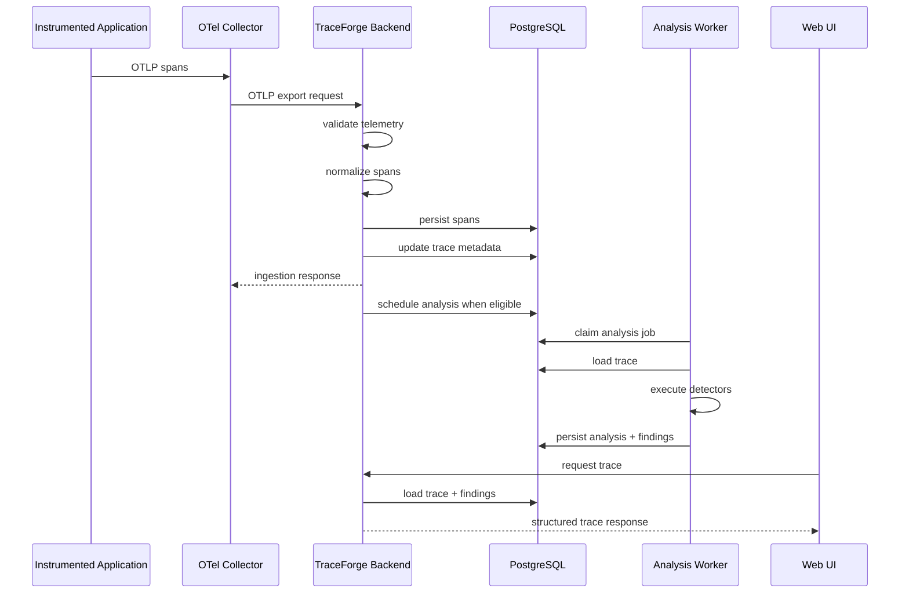

# 10. Data Flow

## 10.1 Purpose

This section defines how data moves through TraceForge from telemetry reception to user-visible diagnostic output.

The objective is to make every major transformation explicit.

A trace should not appear in the product through an undefined sequence of framework callbacks and database side effects.

The system should have a clearly understandable pipeline:

```text
receive
    ↓
validate
    ↓
normalize
    ↓
persist
    ↓
update trace lifecycle
    ↓
schedule analysis
    ↓
analyze
    ↓
persist findings
    ↓
query
    ↓
present
```

Each stage must define:

* its input;
* its output;
* whether it is synchronous or asynchronous;
* what persistent state it changes;
* how failure is represented;
* whether retry is safe.

---

## 10.2 Primary End-to-End Flow

The normal v0.1 flow is:



The most important boundary in this sequence is:

> **Telemetry acknowledgement does not wait for diagnostic analysis.**

Analysis is asynchronous.

---

## 10.3 Ingestion Request Flow

An incoming OTLP request may contain telemetry for:

* one trace;
* multiple traces;
* one service;
* multiple services;
* one span;
* many spans.

TraceForge SHALL therefore treat ingestion as a batch operation containing individually identifiable span records.

The conceptual flow is:

```text
OTLP request
    ↓
protocol decoding
    ↓
batch validation
    ↓
span-level normalization
    ↓
span-level persistence
    ↓
affected trace identification
    ↓
trace metadata updates
    ↓
response
```

---

## 10.4 Protocol Decoding

The ingestion boundary receives OpenTelemetry protocol objects.

At this stage, TraceForge is concerned only with interpreting the transport representation.

The output should be an intermediate representation suitable for validation.

Conceptually:

```text
OTLP protobuf
    ↓
decoded telemetry batch
```

Protocol-specific objects SHOULD NOT escape significantly beyond the ingestion/normalization boundary.

Downstream domain logic should not depend directly on protobuf-generated classes.

---

## 10.5 Validation Flow

Validation occurs before canonical persistence.

Validation should be divided into two levels.

### 10.5.1 Request-Level Validation

Request-level validation determines whether the incoming payload can be processed at all.

Examples include:

```text
malformed protobuf
unsupported content type
invalid compression
unreadable payload
```

Failure at this level may reject the entire request.

---

### 10.5.2 Span-Level Validation

Once the payload is structurally readable, individual spans can be evaluated independently.

Validation may include:

```text
trace_id valid?
span_id valid?
timestamps valid?
required fields representable?
attribute values supported?
```

A malformed individual span SHOULD NOT automatically invalidate unrelated valid spans where protocol semantics allow partial acceptance.

---

## 10.6 Normalization Flow

Valid incoming spans are converted into TraceForge's canonical internal representation.

The conceptual transformation is:

```text
OTLP Span
    ↓
CanonicalSpan
```

Normalization may derive:

* canonical trace ID;
* canonical span ID;
* parent span ID;
* service identity;
* span kind;
* start and end timestamps;
* duration;
* normalized status;
* error observations;
* raw operation classification;
* resource metadata;
* instrumentation metadata.

Normalization SHALL NOT perform expensive diagnostic analysis.

---

## 10.7 Canonical Span Persistence

After normalization, the span is persisted.

The ideal logical operation is:

```text
BEGIN

upsert span

persist attributes/events/resources

update affected trace metadata

COMMIT
```

The precise schema is deferred to Section 11.

Persistence must be safe under duplicate delivery.

For the same:

```text
(trace_id, span_id)
```

TraceForge should normally produce one logical stored span.

---

## 10.8 Duplicate Span Flow

Duplicate telemetry may occur because of retry behaviour in telemetry delivery.

Example:

```text
Collector sends batch
    ↓
TraceForge stores spans
    ↓
response lost
    ↓
Collector retries batch
```

TraceForge must not create duplicate logical spans.

The intended flow is:

```text
incoming span
    ↓
lookup/conflict on (trace_id, span_id)
    ↓
no existing span
        → insert

existing identical span
        → treat as duplicate
        → no logical duplication

existing conflicting span
        → record structural/data conflict
        → apply conflict policy
```

The exact conflicting-duplicate policy will be defined in storage design.

---

## 10.9 Affected Trace Identification

Every accepted span identifies a trace through:

```text
trace_id
```

After persistence, TraceForge determines which logical traces were modified by the batch.

For example:

```text
Batch contains:

Span A → Trace 1
Span B → Trace 1
Span C → Trace 2
Span D → Trace 3
```

The affected trace set is:

```text
Trace 1
Trace 2
Trace 3
```

Lifecycle evaluation SHOULD occur once per affected trace rather than redundantly for every span.

---

## 10.10 Trace Metadata Update

For each affected trace, TraceForge updates derived summary information where appropriate.

Potential metadata includes:

```text
earliest observed start
latest observed end
span count
candidate roots
participating services
known structural issues
last span received at
current completeness state
analysis freshness
```

Some of these values may be updated incrementally.

Others may be recalculated when necessary.

The storage design will determine which approach is used.

---

## 10.11 Trace Completion Problem

Distributed tracing has no universal signal that says:

> No more spans for this trace will ever arrive.

TraceForge therefore needs a **completion policy**.

The policy must balance two competing goals:

```text
Analyze quickly
```

and:

```text
Avoid analyzing before important late spans arrive
```

Waiting indefinitely is impossible.

Analyzing immediately after every span is inefficient and likely incorrect.

---

# 10.12 Proposed Trace Completion Policy

For v0.1, TraceForge SHOULD use a **quiet-period completion policy**.

The core idea is:

> A trace becomes analysis-eligible after no new span has been observed for a configured period and all currently known spans have ended.

Conceptually:

```text
last span received
    ↓
quiet period starts
    ↓
no additional spans arrive
    ↓
quiet period expires
    ↓
trace lifecycle evaluation
    ↓
COMPLETE or INCOMPLETE
```

A starting configuration might be approximately:

```text
TRACE_COMPLETION_QUIET_PERIOD = 2 seconds
```

but the exact default SHALL be benchmarked and may change.

---

## 10.13 Why Quiet-Period Completion

Alternative approaches have significant weaknesses.

### Immediate completion when root span ends

This is unsafe because child spans may be exported later.

### Fixed delay from trace start

Long-running traces make this unreliable.

### Require perfect parent-child closure

Missing telemetry could keep traces processing forever.

### Wait indefinitely

Not operationally acceptable.

The quiet-period approach provides a practical compromise for development workloads.

---

## 10.14 Completion Evaluation

When a quiet period expires, the lifecycle evaluator inspects the trace.

The evaluation may consider:

```text
Have all observed spans ended?

Are known parent references resolved?

Is there exactly one plausible root?

Are there timestamp inconsistencies?

Have additional spans arrived since evaluation was scheduled?
```

The result may be:

```text
COMPLETE
```

or:

```text
INCOMPLETE
```

Both states may still become eligible for analysis.

---

# 10.15 COMPLETE State

A trace may be marked COMPLETE when:

* the quiet period has expired;
* no new spans arrived during that period;
* all observed spans have valid terminal timing information;
* no known structural issue prevents normal interpretation.

COMPLETE means:

> TraceForge has no current evidence that the trace is structurally incomplete.

It does not guarantee that telemetry was never dropped externally.

---

## 10.16 INCOMPLETE State

A trace may be marked INCOMPLETE when the quiet period expires but known structural issues remain.

Examples:

```text
missing parent span
multiple candidate roots
orphaned subtree
invalid temporal relationship
```

Incomplete traces remain inspectable.

Eligible detectors may still run.

---

## 10.17 Lifecycle Scheduling Mechanism

The backend must avoid sleeping or blocking an ingestion request for the quiet period.

Therefore completion evaluation SHALL be asynchronous.

A conceptual mechanism is:

```text
span persisted
    ↓
trace.last_span_received_at updated
    ↓
trace_completion_deadline calculated
    ↓
background lifecycle sweep evaluates expired traces
```

The preferred v0.1 approach is a **database-backed periodic lifecycle sweep** rather than one timer per trace.

---

## 10.18 Lifecycle Sweep

A lightweight background task periodically queries traces satisfying approximately:

```text
state = PROCESSING
AND completion_deadline <= now()
```

It then evaluates them.

Conceptually:

```text
every ~500 ms / 1 s
    ↓
find expired PROCESSING traces
    ↓
claim bounded batch
    ↓
evaluate each trace
    ↓
mark COMPLETE or INCOMPLETE
    ↓
schedule analysis
```

The exact interval is a configuration detail.

---

## 10.19 Why Use a Sweep Instead of Per-Trace Timers

Per-trace in-memory timers introduce problems:

* timers are lost on backend restart;
* large trace counts create many runtime timers;
* lifecycle state becomes tied to one process;
* horizontal scaling becomes difficult;
* recovery is less explicit.

Persisting completion deadlines in PostgreSQL makes the lifecycle durable.

---

## 10.20 Scheduling Analysis

When a trace transitions from:

```text
PROCESSING
```

to:

```text
COMPLETE
```

or eligible:

```text
INCOMPLETE
```

the lifecycle manager creates an analysis job.

Ideally:

```text
BEGIN

update trace completeness state

insert analysis job

set analysis_state = PENDING

COMMIT
```

This creates a strong consistency boundary.

The system should not end up with:

```text
analysis_state = PENDING
```

but no durable job.

---

## 10.21 Analysis Job Lifecycle

An analysis job may move through states such as:

```text
PENDING
    ↓
RUNNING
    ↓
COMPLETE
```

or:

```text
RUNNING
    ↓
FAILED
```

Potential additional state:

```text
RETRY
```

may be represented using:

```text
available_at
attempt_count
last_error
```

rather than requiring a separate enum.

---

## 10.22 Worker Job Claiming

Workers periodically request analysis work from PostgreSQL.

The logical flow is:

```text
begin transaction
    ↓
select available PENDING job
    ↓
lock row
    ↓
mark RUNNING
    ↓
commit
```

Multiple workers must not successfully claim the same job simultaneously.

A likely implementation mechanism is:

```sql
SELECT ...
FOR UPDATE SKIP LOCKED
```

but the exact SQL will be decided in Section 11.

---

# 10.23 Loading Trace for Analysis

Once a job is claimed, the worker loads the required trace data.

The desired flow is:

```text
trace ID
    ↓
repository
    ↓
canonical span records
    ↓
domain Trace
    ↓
derived execution structures
```

The worker SHOULD load enough information to execute detectors without detectors performing arbitrary database access themselves.

---

## 10.24 Analysis Input Snapshot

A major correctness concern is late spans arriving while analysis is running.

Therefore each analysis run should operate against an identifiable trace version or snapshot.

TraceForge SHOULD maintain a trace revision value.

Conceptually:

```text
trace_revision = integer
```

Every meaningful change to canonical trace contents increments the revision.

Example:

```text
Trace revision 14
    ↓
analysis starts
    ↓
late span arrives
    ↓
trace revision becomes 15
```

The analysis run belongs to:

```text
revision 14
```

and can therefore be recognized as stale.

---

## 10.25 Trace Revision

A trace revision SHOULD increment when canonical trace data changes in a way that can affect analysis.

Examples include:

```text
new span inserted
conflicting span replaced or resolved
relevant canonical span data changed
```

Purely derived changes such as adding a finding SHOULD NOT increment the canonical trace revision.

---

## 10.26 Analysis Run Creation

When analysis starts:

```text
AnalysisRun {
    trace_id
    trace_revision
    detector_set_version
    started_at
    state = RUNNING
}
```

is persisted.

This records exactly what trace state the analysis corresponds to.

---

## 10.27 Detector Execution Flow

The worker runs eligible detectors against the loaded domain model.

Conceptually:

```text
Trace
    ↓
build reusable derived structures
    ↓
CriticalPathDetector
    ↓
LatencyContributorDetector
    ↓
RepeatedDatabaseOperationDetector
    ↓
ErrorOriginDetector
```

Common calculations SHOULD be reusable.

For example, the critical path should not be recalculated independently by every detector that needs it.

---

## 10.28 Detector Failure Handling

Each detector executes in an isolated failure boundary.

Example:

```text
CriticalPathDetector
    → SUCCESS

RepeatedDatabaseDetector
    → FAILED

ErrorOriginDetector
    → SUCCESS
```

The entire analysis run may therefore become:

```text
PARTIAL
```

rather than:

```text
FAILED
```

if useful results remain available.

---

## 10.29 Detector Output

Each detector returns a structured result.

Example:

```text
DetectorResult {
    state: SUCCESS_WITH_FINDINGS

    findings: [...]
}
```

or:

```text
DetectorResult {
    state: SUCCESS_NO_FINDINGS
}
```

or:

```text
DetectorResult {
    state: SKIPPED_INSUFFICIENT_DATA
}
```

or:

```text
DetectorResult {
    state: FAILED
    failure_reason: ...
}
```

These distinctions must be persisted.

---

## 10.30 Finding Persistence

Findings are persisted only after validation by the analysis orchestration layer.

The storage operation should maintain relationships between:

```text
AnalysisRun
DetectorResult
Finding
Evidence
RelatedSpan
```

A finding must retain:

```text
trace_id
trace_revision
analysis_run_id
detector_id
detector_version
```

or equivalent information sufficient for reproducibility.

---

## 10.31 Analysis Completion

After detectors finish, the worker determines the analysis run state.

Possible outcomes:

```text
COMPLETE
```

All required detectors executed successfully.

```text
PARTIAL
```

Some detectors produced usable output while others could not execute.

```text
FAILED
```

Analysis produced no reliable result because of system-level failure.

The trace's analysis state is updated accordingly.

---

## 10.32 Stale Analysis Detection

Before publishing an analysis result as current, the worker SHOULD compare:

```text
analysis_run.trace_revision
```

with:

```text
current_trace.trace_revision
```

If they differ:

```text
analysis result is stale
```

because telemetry changed during analysis.

The worker may still retain the run historically, but it SHALL NOT become the current authoritative analysis.

---

## 10.33 Late Span Flow

Consider:

```text
trace revision 8
    ↓
analysis complete
    ↓
late span arrives
```

The desired flow is:

```text
late span accepted
    ↓
canonical span persisted
    ↓
trace revision 9
    ↓
trace state returns to PROCESSING
    ↓
current analysis marked stale
    ↓
completion deadline reset
    ↓
quiet period expires
    ↓
new analysis job scheduled
```

This ensures analysis always corresponds to the latest known telemetry.

---

## 10.34 Preventing Endless Re-analysis

A pathological telemetry source could continually send extremely late spans.

TraceForge SHOULD avoid infinite resource consumption.

Potential safeguards include:

```text
maximum trace age
maximum re-analysis count
late-span cutoff
```

For v0.1, a configurable maximum trace lifecycle window SHOULD exist conceptually.

Example:

```text
TRACE_MAX_LIFETIME = 5 minutes
```

After that point, additional spans may still be stored but automatic re-analysis MAY be suppressed or explicitly flagged.

The exact policy will be finalized later.

---

## 10.35 Query Flow — Trace List

When the frontend requests traces:

```text
GET traces with filters
```

the backend should query trace-level summary data rather than reconstruct every trace.

Conceptually:

```text
UI
    ↓
Query API
    ↓
trace summary query
    ↓
PostgreSQL
    ↓
TraceSummary[]
    ↓
UI
```

This is one reason TraceForge likely benefits from persisted trace metadata.

---

## 10.36 Query Flow — Trace Detail

When a developer opens a specific trace:

```text
trace_id
    ↓
Query API
    ↓
load trace metadata
load spans
load structural issues
load current findings
    ↓
construct TraceDetail response
    ↓
UI
```

The API should avoid one database query per span.

Related data SHOULD be fetched using bounded query patterns.

---

## 10.37 Query Flow — Finding Navigation

When the user selects a finding:

```text
Finding
    ↓
related span IDs
    ↓
frontend highlights already loaded spans
```

If the trace is already loaded, this action SHOULD not require a new API request.

The finding response should therefore contain enough references to connect evidence to loaded span data.

---

## 10.38 Query Flow — Service List

Service inventory may be queried from:

```text
materialized service records
```

and/or:

```text
derived trace/span metadata
```

depending on Section 11 decisions.

The desired user flow is:

```text
UI
    ↓
GET /services
    ↓
Backend
    ↓
service summaries
    ↓
UI
```

The API should not scan every stored attribute to determine service identity during each request.

---

## 10.39 Service Discovery Data Flow

Service discovery begins during normalization.

```text
incoming span
    ↓
extract normalized service identity
    ↓
persist span
    ↓
upsert observed service
    ↓
update first_seen / last_seen
```

Service discovery is therefore incremental.

The service entity exists because telemetry has demonstrated its existence.

---

## 10.40 Service Dependency Data Flow

A service dependency is derived from cross-service span relationships.

Example:

```text
Span A
service = orders-service

child Span B
service = payment-service
```

This provides evidence for:

```text
orders-service → payment-service
```

Dependency derivation MAY occur:

```text
during trace finalization
```

rather than on every individual span arrival.

This reduces repeated work and allows the complete span hierarchy to be considered.

---

## 10.41 Proposed Dependency Update Timing

For v0.1, service dependency aggregation SHOULD occur when a trace becomes analysis-eligible.

Conceptually:

```text
trace completion
    ↓
reconstruct service relationships
    ↓
upsert dependency observations
```

This avoids trying to infer cross-service relationships before parent spans have necessarily arrived.

The implemented v0.1 rule derives only direct parent/child transitions with
known, different service identities. Each trace contributes one observation per
directed edge, timestamped by the earliest child span start time. Re-finalizing
a revised trace atomically replaces its prior observations.

---

## 10.42 System Health Data Flow

TraceForge health information is partly ephemeral and partly persisted.

Examples of ephemeral checks:

```text
process alive
database reachable
```

Examples of persisted operational data:

```text
last telemetry received
last rejected batch
recent analysis failure
queue depth
```

The System API can combine both.

---

## 10.43 Ingestion Failure Flow

If PostgreSQL is unavailable:

```text
OTLP request arrives
    ↓
validation succeeds
    ↓
persistence fails
```

TraceForge SHALL NOT acknowledge the telemetry as safely accepted.

The request should fail according to appropriate OTLP semantics so the Collector may retry.

This preserves telemetry reliability.

---

## 10.44 Analysis Failure Flow

If the worker cannot complete analysis:

```text
job RUNNING
    ↓
exception
    ↓
attempt recorded
```

Transient failures may be retried.

Permanent or repeatedly failing jobs eventually become:

```text
FAILED
```

The trace remains queryable.

The UI sees:

```text
Analysis unavailable
```

rather than:

```text
No findings detected
```

---

## 10.45 Worker Crash Recovery

Consider:

```text
worker claims Job 42
    ↓
marks RUNNING
    ↓
worker process crashes
```

Without recovery, Job 42 could remain RUNNING forever.

Analysis jobs therefore need a lease or timeout mechanism.

Conceptually:

```text
claimed_at
lease_expires_at
```

If:

```text
state = RUNNING
AND lease_expires_at < now()
```

the job becomes eligible for recovery.

---

## 10.46 Job Retry Policy

Jobs SHOULD use bounded retries.

Conceptually:

```text
attempt 1
    ↓ fail
attempt 2
    ↓ fail
attempt 3
    ↓ fail
FAILED
```

Potential configuration:

```text
MAX_ANALYSIS_ATTEMPTS = 3
```

Transient errors may use exponential or bounded backoff.

Detector-specific failures should not normally cause the entire analysis job to retry if the orchestrator successfully completed a partial run.

---

## 10.47 Lifecycle Sweep Recovery

Trace completion evaluation must also survive backend restarts.

Because completion deadlines are persisted:

```text
backend stops
    ↓
quiet deadline passes
    ↓
backend restarts
    ↓
lifecycle sweep sees expired trace
    ↓
evaluation continues
```

No in-memory timer restoration is required.

---

## 10.48 Ordering Guarantees

TraceForge SHALL NOT assume that telemetry arrives in execution order.

The following may occur:

```text
child before parent
later operation before earlier operation
two batches reordered
duplicate batch
```

Correct reconstruction depends on identifiers and timestamps, not arrival sequence.

Arrival time may be used for lifecycle management but not as the primary execution ordering mechanism.

---

## 10.49 Timestamp Roles

TraceForge deals with at least two distinct notions of time.

### Execution time

Derived from OpenTelemetry span timestamps.

Used for:

* waterfall rendering;
* critical path;
* ordering execution;
* latency analysis.

### Ingestion time

Recorded by TraceForge when telemetry is received.

Used for:

* completion quiet period;
* operational diagnosis;
* last-seen information;
* lifecycle management.

These SHALL NOT be conflated.

---

## 10.50 Clock Skew

Distributed systems may contain imperfectly synchronized clocks.

TraceForge SHALL therefore treat impossible or suspicious timing relationships carefully.

Example:

```text
child span begins 50 ms before parent span
```

This may represent:

* clock skew;
* malformed telemetry;
* valid instrumentation edge behaviour.

TraceForge SHOULD preserve the raw timestamps and record structural/timing issues rather than silently rewriting them.

The critical-path algorithm will define its tolerance strategy later.

---

## 10.51 Data Transformation Layers

The complete transformation can be summarized as:

```text
Layer 1
OTLP transport data

        ↓

Layer 2
Canonical telemetry

Span
Resource
Event
ErrorObservation

        ↓

Layer 3
Reconstructed execution

Trace
parent-child relationships
Service
Operation
StructuralIssue

        ↓

Layer 4
Derived analysis

CriticalPath
DetectorResult
Finding
Evidence

        ↓

Layer 5
API representation

TraceSummary
TraceDetail
FindingResponse
ServiceResponse

        ↓

Layer 6
Presentation

waterfall
finding cards
service graph
span inspector
```

No layer should needlessly overwrite the preceding one.

---

## 10.52 Data Mutation Ownership

The major mutations are:

```text
Ingestion
    creates/updates canonical spans

Lifecycle Manager
    updates trace lifecycle state

Service Discovery
    updates observed service metadata

Analysis Scheduler
    creates analysis jobs

Analysis Worker
    creates analysis runs/results/findings

Query API
    read-only for telemetry/analysis data

Frontend
    no direct persistent domain mutation in v0.1
```

This keeps data ownership explicit.

---

## 10.53 Idempotency Requirements

Several operations should be safely repeatable.

### Span persistence

Repeated identical span ingestion should not duplicate data.

### Service discovery

Observing the same service repeatedly should update metadata rather than create duplicates.

### Analysis scheduling

The same trace revision should not accumulate multiple equivalent pending analysis jobs.

### Worker retry

Retrying a failed analysis job should not create duplicate current findings.

### Dependency aggregation

Reprocessing the same trace revision should not incorrectly inflate relationship counts.

The storage design must support these properties.

---

## 10.54 Analysis Job Deduplication

Analysis jobs SHOULD logically correspond to:

```text
(trace_id, trace_revision)
```

There should normally be at most one active analysis job for a given revision.

Conceptually:

```text
UNIQUE(trace_id, trace_revision)
```

or equivalent application logic may enforce this.

---

## 10.55 Current Analysis Selection

A trace may have several historical analysis runs.

The current analysis is the newest successful or partially successful run whose:

```text
trace_revision
```

matches the current canonical trace revision.

Conceptually:

```text
current trace revision = 12

AnalysisRun revision 10 → stale
AnalysisRun revision 11 → stale
AnalysisRun revision 12 → current
```

---

## 10.56 Data Retention Flow

Detailed retention policy is deferred, but the architecture should anticipate:

```text
retention task
    ↓
identify expired traces
    ↓
delete dependent analysis data
    ↓
delete spans
    ↓
delete trace metadata
    ↓
update service/dependency aggregates if required
```

This implies that persisted aggregates must either:

* tolerate historical deletion;
* be recomputable;
* or have explicitly defined retention semantics.

---

## 10.57 Example: Normal Trace

Consider:

```text
gateway
    ↓
orders-service
    ↓
database
```

The flow is:

```text
1. Three spans arrive.

2. Backend validates them.

3. Backend normalizes them.

4. Spans are persisted.

5. Trace revision becomes 1.

6. completion_deadline = last_received + quiet_period.

7. No additional spans arrive.

8. Lifecycle sweep evaluates trace.

9. Trace becomes COMPLETE.

10. Analysis job for revision 1 is created.

11. Worker claims job.

12. Detectors execute.

13. No abnormal behaviour detected.

14. AnalysisRun becomes COMPLETE.

15. Trace analysis state becomes COMPLETE.

16. UI displays:
    "No significant findings detected."
```

---

## 10.58 Example: Repeated Database Operations

Telemetry contains:

```text
orders-service
    ├── SELECT product WHERE id = 1
    ├── SELECT product WHERE id = 2
    ├── ...
    └── SELECT product WHERE id = 34
```

Flow:

```text
canonical spans persisted
    ↓
trace completion
    ↓
analysis job
    ↓
operation normalization
    ↓
34 database spans grouped
    ↓
timing relationships evaluated
    ↓
RepeatedDatabaseOperationDetector
    ↓
structured finding
    ↓
evidence references 34 spans
    ↓
finding persisted
    ↓
UI highlights those spans
```

---

## 10.59 Example: Late Span

Initial telemetry:

```text
gateway
    ↓
orders-service
```

Trace becomes COMPLETE and is analyzed.

Then:

```text
payment-service span arrives late
```

Flow:

```text
late span accepted
    ↓
trace revision 1 → 2
    ↓
current analysis revision 1 becomes stale
    ↓
trace state PROCESSING
    ↓
completion deadline reset
    ↓
quiet period expires
    ↓
trace COMPLETE
    ↓
analysis job revision 2
    ↓
new findings produced
```

The UI SHALL not continue presenting revision 1 analysis as current.

---

## 10.60 Example: Incomplete Trace

Telemetry contains:

```text
gateway
    ↓
orders-service
        ↓
parent ID references missing span
            ↓
payment-service
```

After the quiet period:

```text
known parent unresolved
    ↓
Trace = INCOMPLETE
    ↓
Analysis = PENDING
```

The worker evaluates detectors individually.

Example:

```text
RepeatedDatabaseDetector
    → SUCCESS_NO_FINDINGS

CriticalPathDetector
    → SKIPPED_INSUFFICIENT_DATA

ErrorOriginDetector
    → SUCCESS_WITH_FINDINGS
```

Final analysis state:

```text
PARTIAL
```

The UI displays both:

```text
Trace incomplete
```

and the valid findings.

---

## 10.61 Example: Worker Crash

```text
Job 81 claimed
    ↓
state RUNNING
    ↓
lease until 22:14:30
    ↓
worker crashes
```

At:

```text
22:14:30
```

the lease expires.

Another worker or the restarted worker may reclaim the job.

Because findings are tied to an AnalysisRun and trace revision, partially persisted output must either:

* remain isolated as an incomplete analysis run;
* or be transactionally cleaned/replaced.

The storage design must make this safe.

---

## 10.62 Data Flow Performance Principle

The ingestion path must remain short.

The preferred critical path is:

```text
decode
validate
normalize
persist
respond
```

The following SHOULD NOT occur before responding to the Collector:

```text
critical-path calculation
repeated-query grouping
service graph aggregation
finding generation
historical comparison
UI projection building
```

These operations belong outside telemetry acknowledgement.

---

## 10.63 Data Flow Reliability Principle

Persistent state should advance monotonically through well-defined transitions wherever possible.

For example:

```text
Span:
not persisted
    ↓
persisted
```

```text
Trace:
PROCESSING
    ↓
COMPLETE / INCOMPLETE
```

```text
Analysis Job:
PENDING
    ↓
RUNNING
    ↓
COMPLETE / FAILED
```

Ambiguous transient states should be minimized.

---

## 10.64 Data Flow Observability

TraceForge SHOULD eventually measure at least:

```text
OTLP request count
spans accepted
spans rejected

ingestion duration

PROCESSING trace count
completion sweep duration

analysis queue depth
analysis job wait time
analysis execution time

re-analysis count
late span count

detector execution duration
detector failure count
```

These measurements will allow later architectural decisions to be based on evidence.

---

## 10.65 Resolved Architecture Question: Trace Lifecycle Execution

Section 9 left Q-ARCH-001 unresolved.

The initial decision is:

> **Trace completion is evaluated asynchronously using a persistent completion deadline and a periodic lifecycle sweep managed by the backend.**

The worker is responsible for analysis, not deciding ordinary trace completion.

This keeps lifecycle management close to ingestion while avoiding in-request delays and fragile in-memory timers.

---

## 10.66 Resolved Architecture Question: Late Telemetry

Late telemetry SHALL:

```text
update canonical trace data
increment trace revision
invalidate current analysis
return trace to PROCESSING where appropriate
reset completion deadline
schedule re-analysis after completion
```

This provides a deterministic relationship between telemetry state and diagnostic output.

---

## 10.67 Data Flow Open Questions

The following details remain unresolved.

### Q-DATA-001 — Quiet period duration

What default completion quiet period provides the best balance between:

```text
fast findings
```

and:

```text
late-span tolerance
```

?

This should be validated against the demo application and real OpenTelemetry batching behaviour.

---

### Q-DATA-002 — Maximum trace lifetime

How long should automatic lifecycle management continue accepting late telemetry before re-analysis is suppressed?

---

### Q-DATA-003 — Conflicting duplicate spans

If identical:

```text
trace_id + span_id
```

arrive with different canonical data, should TraceForge:

```text
keep first
keep latest
reject conflicting update
store conflict versions
```

?

This will be resolved in storage design.

---

### Q-DATA-004 — Analysis atomicity

Should findings become visible:

```text
only after the entire AnalysisRun commits
```

or incrementally as detectors complete?

For v0.1, atomic publication of a completed run is likely preferable.

---

### Q-DATA-005 — Trace revision implementation

Should revision be:

```text
simple integer increment
```

or derived from another canonical version mechanism?

A monotonic integer is currently preferred.

---

## 10.68 Data Flow Decision Summary

The initial data-flow design makes the following decisions:

```text
D-001
OTLP ingestion is synchronous only through canonical persistence.

D-002
Diagnostic analysis is never part of the ingestion request path.

D-003
Incoming spans are normalized before domain use.

D-004
Trace lifecycle state is persisted.

D-005
Trace completion uses a quiet-period policy.

D-006
Completion deadlines are persistent rather than in-memory timers.

D-007
A backend lifecycle sweep evaluates expired PROCESSING traces.

D-008
Analysis jobs are created when traces become eligible.

D-009
Analysis operates against a specific trace revision.

D-010
Late canonical telemetry increments the trace revision.

D-011
Analysis for older trace revisions becomes stale.

D-012
Worker jobs use durable claiming and bounded retry.

D-013
Detector failure does not automatically invalidate unrelated detector results.

D-014
Query APIs read persisted canonical and derived data.

D-015
Execution time and ingestion time are separate concepts.
```

---

## 10.69 Data Flow Principle

The TraceForge data pipeline should preserve one fundamental property:

> **At any point, it must be possible to explain how a piece of user-visible diagnostic information was derived from persisted telemetry.**

The intended chain is:

```text
OTLP span
    ↓
canonical span
    ↓
trace revision
    ↓
analysis run
    ↓
detector result
    ↓
finding
    ↓
evidence
    ↓
user-visible diagnosis
```

If a finding cannot be traced through this chain, the data flow is insufficiently explicit.
