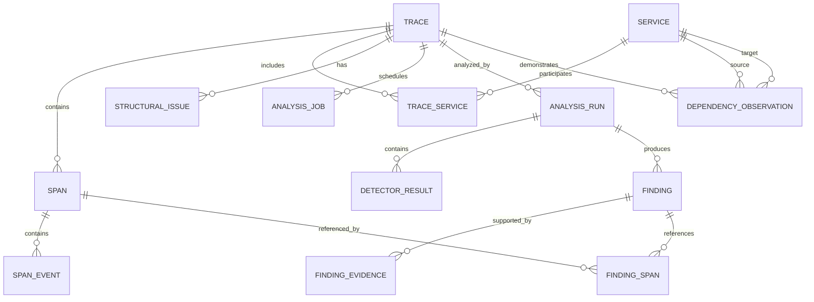

# 11. Storage Design

## 11.1 Purpose

This section defines how TraceForge v0.1 stores canonical telemetry and derived diagnostic data.

The storage design must support:

* reliable telemetry ingestion;
* idempotent span persistence;
* trace reconstruction;
* efficient trace listing and filtering;
* late-span handling;
* trace revisioning;
* asynchronous analysis scheduling;
* analysis reproducibility;
* finding-to-evidence navigation;
* service discovery;
* observed service dependency reconstruction.

The initial storage system SHALL be PostgreSQL.

The design should optimize for:

```text
correctness
clarity
queryability
moderate development-scale performance
```

rather than maximum telemetry throughput.

---

## 11.2 Storage Design Principles

The persistence model SHALL follow several principles.

### Canonical telemetry and derived data remain distinguishable

TraceForge stores both:

```text
what was observed
```

and:

```text
what TraceForge concluded from it
```

These categories SHALL not be mixed conceptually.

---

### Common query fields should be relational

Frequently filtered or joined values SHOULD be stored in explicit typed columns.

Examples include:

```text
trace_id
span_id
service_id
start_time
duration
status
finding_type
analysis_state
```

---

### High-cardinality flexible telemetry belongs in JSONB where appropriate

OpenTelemetry attributes are dynamic and potentially unbounded.

The database schema SHOULD not create one column for every possible semantic attribute.

---

### Derived data must remain reproducible

Findings should retain enough metadata to identify:

```text
which trace revision was analyzed
which detector produced the result
which detector version was used
which evidence supported the result
```

---

### Ingestion should require bounded database work

Accepting one batch of spans SHOULD NOT require expensive reconstruction or graph analysis.

---

### Trace list queries should not scan span data

Trace-level metadata SHALL be materialized sufficiently to support common list and filter operations efficiently.

---

## 11.3 High-Level Persistence Model

The initial schema is expected to contain approximately the following entities:

```text
traces
spans
services
span_events

trace_structural_issues

analysis_jobs
analysis_runs
detector_results
findings
finding_evidence
finding_spans

service_dependencies
service_dependency_observations
```

Conceptually:

```text
Trace
 ├── Span
 │    └── SpanEvent
 │
 ├── StructuralIssue
 │
 ├── AnalysisJob
 │
 └── AnalysisRun
      ├── DetectorResult
      └── Finding
           ├── Evidence
           └── RelatedSpan

Service
 └── ServiceDependency
```

The exact SQL names may change slightly during implementation.

---

## 11.4 Identifier Representation

OpenTelemetry identifiers are binary values.

A Trace ID is 16 bytes.

A Span ID is 8 bytes.

TraceForge SHOULD preserve them in a compact binary form internally.

The preferred PostgreSQL representation is:

```text
trace_id BYTEA
span_id  BYTEA
```

with application-level validation enforcing exact lengths.

Alternative textual hexadecimal representations are easier to inspect manually but approximately double storage size and increase index size.

The application/API layer may expose IDs as lowercase hexadecimal strings.

Conceptually:

```text
database:
0x4bf92f3577b34da6a3ce929d0e0e4736

API:
"4bf92f3577b34da6a3ce929d0e0e4736"
```

---

## 11.5 Internal Identifiers

TraceForge MAY use internal surrogate identifiers for relational convenience.

For example:

```text
service_id BIGINT
finding_id UUID
analysis_run_id UUID
analysis_job_id BIGINT
```

Canonical OpenTelemetry identifiers remain authoritative for telemetry identity.

A surrogate identifier SHALL NOT replace:

```text
trace_id
span_id
```

for deduplication or trace reconstruction.

---

## 11.6 `traces` Table

The `traces` table stores materialized trace-level metadata.

This table exists primarily because common product workflows require efficient trace-level queries.

A conceptual schema is:

```sql
traces (
    trace_id                BYTEA PRIMARY KEY,

    revision                BIGINT NOT NULL,

    first_span_start_time   TIMESTAMPTZ,
    last_span_end_time      TIMESTAMPTZ,

    first_received_at       TIMESTAMPTZ NOT NULL,
    last_received_at        TIMESTAMPTZ NOT NULL,

    completion_deadline     TIMESTAMPTZ,

    duration_ns             BIGINT,

    span_count              INTEGER NOT NULL,

    root_span_count         INTEGER NOT NULL DEFAULT 0,

    root_service_id         BIGINT NULL,

    root_operation          TEXT NULL,

    status                  TEXT NOT NULL,

    completeness_state      TEXT NOT NULL,
    analysis_state          TEXT NULL,

    current_analysis_run_id UUID NULL,

    has_findings            BOOLEAN NOT NULL DEFAULT FALSE,

    created_at              TIMESTAMPTZ NOT NULL,
    updated_at              TIMESTAMPTZ NOT NULL
)
```

`analysis_state` is `NULL` until a finalized trace revision is scheduled for analysis.

The exact types for enums may use PostgreSQL enums, text with constraints, or application-defined typed values.

That decision will be finalized during implementation.

---

## 11.7 Why Materialize Trace Metadata

Without a `traces` table, a simple query such as:

```text
Show failed traces from payment-service
during the last 15 minutes
ordered by duration.
```

could require repeated aggregation across the `spans` table.

The `traces` table provides a stable summary index.

It enables efficient access to:

```text
trace list
trace status
trace duration
analysis state
finding presence
completion state
trace revision
```

without reconstructing every trace.

---

## 11.8 Trace Revision Storage

Every trace SHALL contain:

```text
revision BIGINT
```

A new trace begins at:

```text
revision = 1
```

or equivalent.

The revision increments whenever canonical telemetry changes in a way that may affect analysis.

Examples:

```text
new span inserted
conflicting canonical span resolved
canonical span changed through accepted update policy
```

The revision SHALL NOT increment for:

```text
new finding
analysis state transition
UI access
derived aggregate update
```

---

## 11.9 Trace Revision Update Atomicity

A new canonical span and its corresponding trace revision increment SHOULD occur in the same transaction.

Conceptually:

```text
BEGIN

INSERT span

UPDATE traces
SET revision = revision + 1,
    last_received_at = now(),
    completeness_state = PROCESSING,
    completion_deadline = ...

COMMIT
```

This ensures that:

```text
new telemetry exists
```

cannot become visible while:

```text
trace revision still represents the old telemetry set
```

---

## 11.10 `spans` Table

The `spans` table stores canonical normalized span data.

A conceptual schema is:

```sql
spans (
    trace_id                BYTEA NOT NULL,
    span_id                 BYTEA NOT NULL,

    parent_span_id          BYTEA NULL,

    service_id              BIGINT NULL,

    name                    TEXT NOT NULL,
    operation_type          TEXT NOT NULL,

    normalized_operation    TEXT NULL,

    span_kind               TEXT NOT NULL,

    start_time              TIMESTAMPTZ NOT NULL,
    end_time                TIMESTAMPTZ NULL,

    duration_ns             BIGINT NULL,

    status                  TEXT NOT NULL,

    attributes              JSONB NOT NULL,
    resource_attributes     JSONB NOT NULL,

    instrumentation_name    TEXT NULL,
    instrumentation_version TEXT NULL,

    received_at             TIMESTAMPTZ NOT NULL,

    PRIMARY KEY (trace_id, span_id)
)
```

This schema is conceptual and may evolve.

---

## 11.11 Span Primary Key

The logical uniqueness constraint SHALL be:

```text
(trace_id, span_id)
```

This directly enforces the domain invariant:

> A logical span may appear only once within a trace.

It also provides the first line of protection against duplicate telemetry delivery.

---

## 11.12 Parent Span Relationships

TraceForge SHOULD NOT create a strict database foreign key from:

```text
(trace_id, parent_span_id)
```

to another span row.

Reason:

A valid child span may arrive before its parent.

A strict immediate foreign key would reject valid out-of-order telemetry.

Parent relationships SHALL instead be validated and reconstructed at the domain level.

This is an intentional example where database referential enforcement would conflict with valid telemetry behaviour.

---

## 11.13 Span Attributes

OpenTelemetry attributes are dynamic key-value collections.

The initial representation SHOULD use:

```text
attributes JSONB
```

and:

```text
resource_attributes JSONB
```

This provides flexibility without requiring schema migrations whenever new telemetry attributes appear.

---

## 11.14 Why Not Normalize Every Attribute

A schema such as:

```text
span_attributes
----------------
trace_id
span_id
key
value
```

would provide fully relational storage but could dramatically multiply row counts.

Example:

```text
100,000 spans
×
20 attributes
=
2,000,000 attribute rows
```

For the v0.1 workload, this adds complexity without clear product value.

JSONB is therefore preferred initially.

---

## 11.15 Promoted Attributes

Certain attributes may be queried frequently enough to justify typed columns.

Examples may include:

```text
HTTP method
HTTP route
HTTP response code
database system
database namespace
RPC service
RPC method
```

These SHOULD NOT all be promoted immediately.

The rule should be:

> Promote an attribute when TraceForge frequently filters, joins, groups, or analyzes it.

The original attribute remains preserved in JSONB.

---

## 11.16 Normalized Operation Storage

The preferred v0.1 model is to persist:

```text
normalized_operation
```

on the span when a reliable normalization result exists.

Reasons include:

* repeated-operation detectors use it frequently;
* normalization does not need to repeat for every analysis run;
* operation grouping becomes efficient;
* the result can be inspected and debugged.

However:

```text
normalized_operation
```

is derived data.

It SHOULD therefore be reproducible from canonical span information and normalization rules.

---

## 11.17 Normalization Version

Because normalization logic may evolve, TraceForge SHOULD consider storing:

```text
normalization_version
```

either per span or globally per persisted derived normalization.

Conceptually:

```text
normalized_operation = "GET /products/{id}"
normalization_version = 1
```

This allows future migrations or re-normalization when rules change.

For v0.1 this MAY be a simple integer.

---

## 11.18 Span Events

Span events SHOULD be stored in a separate table rather than embedded exclusively inside the main span row.

Conceptually:

```sql
span_events (
    event_id        BIGSERIAL PRIMARY KEY,

    trace_id        BYTEA NOT NULL,
    span_id         BYTEA NOT NULL,

    event_index     INTEGER NOT NULL,

    name            TEXT NOT NULL,
    timestamp_unix_ns BIGINT NULL,

    attributes      JSONB NOT NULL
)
```

---

## 11.19 Why Separate Events

Exception information and other events may be important for:

```text
error origin detection
exception inspection
finding evidence
```

A separate table provides:

* direct querying;
* event ordering;
* less bloated span rows;
* cleaner exception extraction.

The composite relationship:

```text
(trace_id, span_id)
```

may reference the span.

Because the span is persisted in the same transaction, a normal foreign key is practical here.

---

## 11.20 Exception Representation

TraceForge SHOULD preserve original exception events.

It MAY additionally derive normalized exception information such as:

```text
exception_type
exception_message
exception_stacktrace
```

These values may either remain inside event attributes or be promoted later if repeated analysis justifies it.

No separate `exceptions` table is required for v0.1 unless implementation experience demonstrates clear value.

---

## 11.21 Services Table

Observed services SHOULD be persisted explicitly.

Conceptually:

```sql
services (
    service_id      BIGSERIAL PRIMARY KEY,

    service_name    TEXT NOT NULL,

    namespace       TEXT NULL,

    first_seen_at   TIMESTAMPTZ NOT NULL,
    last_seen_at    TIMESTAMPTZ NOT NULL,

    UNIQUE(service_name, namespace)
)
```

The final service identity rules remain dependent on OpenTelemetry normalization decisions.

---

## 11.22 Service Instances

TraceForge v0.1 SHOULD distinguish:

```text
logical service
```

from:

```text
service instance
```

conceptually, but it does not necessarily need a first-class `service_instances` table initially.

For example:

```text
orders-service
```

may run as:

```text
orders-service instance A
orders-service instance B
orders-service instance C
```

The primary UI and dependency graph are interested in the logical service.

Instance metadata may remain in resource attributes until a concrete feature requires explicit instance modelling.

---

## 11.23 Service Upsert Flow

When normalization identifies a service:

```text
service_name = orders-service
```

TraceForge performs an idempotent upsert.

Conceptually:

```sql
INSERT INTO services (...)
VALUES (...)
ON CONFLICT (...)
DO UPDATE SET
    last_seen_at = GREATEST(
        services.last_seen_at,
        EXCLUDED.last_seen_at
    );
```

This keeps service discovery incremental.

---

## 11.24 Trace-to-Service Membership

TraceForge must efficiently answer:

```text
Which services participated in this trace?
```

and:

```text
Which traces involved payment-service?
```

A dedicated join table is therefore recommended.

Conceptually:

```sql
trace_services (
    trace_id    BYTEA NOT NULL,
    service_id  BIGINT NOT NULL,

    PRIMARY KEY(trace_id, service_id)
)
```

---

## 11.25 Why `trace_services` Exists

Without this table, filtering:

```text
all traces involving payment-service
```

would require repeatedly searching span rows.

The join table provides:

* efficient service-based trace filtering;
* participating-service counts;
* service-to-trace navigation.

It is derived from spans but inexpensive to maintain.

---

## 11.26 Trace Structural Issues

Known reconstruction problems SHOULD be stored explicitly.

Conceptually:

```sql
trace_structural_issues (
    issue_id        BIGSERIAL PRIMARY KEY,

    trace_id        BYTEA NOT NULL,

    issue_type      TEXT NOT NULL,

    details         JSONB NOT NULL,

    created_at      TIMESTAMPTZ NOT NULL
)
```

Examples:

```text
MISSING_PARENT
MULTIPLE_ROOTS
INVALID_TIMESTAMPS
DUPLICATE_SPAN_CONFLICT
```

---

## 11.27 Structural Issue Lifecycle

Structural issues may change when late spans arrive.

Example:

```text
revision 4:
MISSING_PARENT
```

then:

```text
late parent arrives
```

and:

```text
revision 5:
issue resolved
```

For v0.1, structural issues SHOULD represent the current trace state.

Historical structural issue tracking is not necessary unless needed for analysis reproducibility.

Analysis runs already record the trace revision they consumed.

---

## 11.28 Analysis Jobs

Analysis scheduling SHALL be persisted in PostgreSQL.

Conceptual schema:

```sql
analysis_jobs (
    job_id              BIGSERIAL PRIMARY KEY,

    trace_id            BYTEA NOT NULL,
    trace_revision      BIGINT NOT NULL,

    state               TEXT NOT NULL,

    attempt_count       INTEGER NOT NULL DEFAULT 0,

    available_at        TIMESTAMPTZ NOT NULL,

    claimed_at          TIMESTAMPTZ NULL,
    lease_expires_at    TIMESTAMPTZ NULL,

    completed_at        TIMESTAMPTZ NULL,

    last_error          TEXT NULL,

    created_at          TIMESTAMPTZ NOT NULL,

    UNIQUE(trace_id, trace_revision)
)
```

---

## 11.29 Analysis Job Deduplication

The constraint:

```text
UNIQUE(trace_id, trace_revision)
```

prevents multiple equivalent jobs being scheduled for the same canonical trace state.

This allows analysis scheduling to be safely retried.

---

## 11.30 Job Claiming

The preferred PostgreSQL pattern is:

```sql
SELECT job_id
FROM analysis_jobs
WHERE state = 'PENDING'
  AND available_at <= now()
ORDER BY available_at, job_id
FOR UPDATE SKIP LOCKED
LIMIT ...
```

The selected jobs are then transitioned to:

```text
RUNNING
```

within the same transaction.

This enables multiple worker processes to claim jobs safely without a dedicated message broker.

---

## 11.31 Job Lease

A claimed job SHALL include a lease expiration.

For example:

```text
lease_expires_at = now() + configured_lease
```

If the worker crashes, another worker can later recover the job.

Recovery query conceptually searches for:

```text
state = RUNNING
AND lease_expires_at < now()
```

Such jobs may be returned to:

```text
PENDING
```

with incremented retry metadata.

---

## 11.32 Analysis Runs

Every actual execution of analysis SHALL have its own record.

Conceptually:

```sql
analysis_runs (
    analysis_run_id      UUID PRIMARY KEY,

    trace_id             BYTEA NOT NULL,
    trace_revision       BIGINT NOT NULL,

    state                TEXT NOT NULL,

    detector_set_version TEXT NOT NULL,

    started_at           TIMESTAMPTZ NOT NULL,
    completed_at         TIMESTAMPTZ NULL,

    created_at           TIMESTAMPTZ NOT NULL
)
```

Multiple analysis runs may exist for one trace.

---

## 11.33 Why Separate Job and Run

An `analysis_job` represents:

> Work that should be executed.

An `analysis_run` represents:

> An actual execution attempt that produced analysis state.

One job may theoretically cause multiple run attempts because of transient failure.

Keeping these concepts separate improves recovery and observability.

---

## 11.34 Detector Results

Each detector execution SHOULD be persisted.

Conceptually:

```sql
detector_results (
    detector_result_id   UUID PRIMARY KEY,

    analysis_run_id      UUID NOT NULL,

    detector_id          TEXT NOT NULL,
    detector_version     TEXT NOT NULL,

    state                TEXT NOT NULL,

    duration_ns          BIGINT NULL,

    failure_reason       TEXT NULL,

    created_at           TIMESTAMPTZ NOT NULL
)
```

Possible states include:

```text
SUCCESS_WITH_FINDINGS
SUCCESS_NO_FINDINGS
SKIPPED_INSUFFICIENT_DATA
FAILED
```

---

## 11.35 Findings

Findings SHOULD be represented relationally for common metadata.

Conceptually:

```sql
findings (
    finding_id           UUID PRIMARY KEY,

    analysis_run_id      UUID NOT NULL,

    trace_id             BYTEA NOT NULL,
    trace_revision       BIGINT NOT NULL,

    detector_result_id   UUID NOT NULL,

    finding_type         TEXT NOT NULL,

    severity             TEXT NOT NULL,
    confidence           TEXT NOT NULL,

    title                TEXT NOT NULL,
    summary              TEXT NOT NULL,

    interpretation       TEXT NULL,

    structured_data      JSONB NOT NULL,

    created_at           TIMESTAMPTZ NOT NULL
)
```

---

## 11.36 Structured Finding Data

Finding-type-specific data SHOULD live inside:

```text
structured_data JSONB
```

Example:

```json
{
  "operation": "SELECT product WHERE id = ?",
  "count": 34,
  "sequential_count": 31,
  "combined_duration_ns": 2070000000,
  "trace_duration_ns": 2810000000
}
```

Common finding metadata remains relational.

This gives the schema flexibility as detector outputs evolve.

---

## 11.37 Why Findings Are Not Pure JSON

A single JSON document per finding would be simple but would make common operations harder.

TraceForge needs to efficiently query:

```text
finding type
severity
confidence
trace
detector
analysis run
creation time
```

These fields therefore deserve explicit columns.

Detector-specific evidence can remain flexible.

---

## 11.38 Finding-to-Span Relationships

A finding may reference multiple spans.

A join table SHALL therefore exist.

Conceptually:

```sql
finding_spans (
    finding_id   UUID NOT NULL,
    trace_id     BYTEA NOT NULL,
    span_id      BYTEA NOT NULL,

    relation     TEXT NULL,

    PRIMARY KEY(finding_id, trace_id, span_id)
)
```

The optional `relation` may describe roles such as:

```text
PRIMARY
CONTRIBUTOR
PROPAGATED_ERROR
REPEATED_OPERATION
```

if useful.

---

## 11.39 Finding Evidence

Structured evidence MAY initially be stored inside the finding's JSONB.

However, a separate evidence table provides clearer extensibility.

Preferred conceptual model:

```sql
finding_evidence (
    evidence_id      UUID PRIMARY KEY,

    finding_id       UUID NOT NULL,

    evidence_type    TEXT NOT NULL,

    structured_data  JSONB NOT NULL,

    description      TEXT NULL
)
```

This permits one finding to contain multiple independently meaningful evidence records.

---

## 11.40 Example Finding Persistence

A repeated-query finding might produce:

```text
Finding

type:
REPEATED_DATABASE_OPERATION

severity:
MEDIUM

confidence:
HIGH
```

with evidence:

```text
Evidence 1
type = OPERATION_COUNT
count = 34
```

```text
Evidence 2
type = COMBINED_DURATION
duration = 2.07 s
```

```text
Evidence 3
type = SEQUENTIAL_EXECUTION
sequential_count = 31
```

and 34 rows in:

```text
finding_spans
```

referencing the underlying telemetry.

---

## 11.41 Analysis Publication

Findings from a partially written analysis run SHOULD NOT become the current analysis accidentally.

The preferred strategy is:

```text
1. create AnalysisRun RUNNING

2. execute detectors

3. persist detector results/findings

4. verify trace revision is still current

5. mark AnalysisRun COMPLETE/PARTIAL

6. update traces.current_analysis_run_id

7. update traces.analysis_state

8. update traces.has_findings
```

Steps 5–8 SHOULD occur transactionally.

---

## 11.42 Atomic Current-Analysis Selection

Publishing a new current analysis should conceptually perform:

```text
BEGIN

verify trace.revision = analysis_run.trace_revision

mark analysis run completed

set trace.current_analysis_run_id

set trace.analysis_state

set trace.has_findings

COMMIT
```

If the revision no longer matches:

```text
analysis run = STALE
```

or equivalent.

It SHALL NOT become current.

---

## 11.43 Stale Analysis Runs

Superseded analysis runs SHOULD initially be retained.

Reasons include:

* debugging;
* reproducibility;
* validating late-span behaviour;
* detector regression testing;
* portfolio demonstration of proper lifecycle design.

Because the intended data scale is moderate, retaining them is acceptable initially.

A later retention process may remove stale historical runs.

---

## 11.44 Service Dependencies

Observed service relationships SHOULD be materialized.

Conceptual schema:

```sql
service_dependencies (
    source_service_id    BIGINT NOT NULL,
    target_service_id    BIGINT NOT NULL,

    first_seen_at        TIMESTAMPTZ NOT NULL,
    last_seen_at         TIMESTAMPTZ NOT NULL,

    observation_count    BIGINT NOT NULL,

    PRIMARY KEY(
        source_service_id,
        target_service_id
    )
)
```

---

## 11.45 Dependency Observations

Simply storing aggregate counts introduces a problem:

If the same trace is reprocessed after a late span, TraceForge must not count the same dependency twice.

Therefore per-trace dependency evidence SHOULD be persisted.

Conceptually:

```sql
service_dependency_observations (
    trace_id             BYTEA NOT NULL,

    source_service_id    BIGINT NOT NULL,
    target_service_id    BIGINT NOT NULL,

    trace_revision       BIGINT NOT NULL,

    observed_at          BIGINT NOT NULL,

    PRIMARY KEY(
        trace_id,
        source_service_id,
        target_service_id
    )
)
```

The current row can be updated when the trace revision changes.

In the implemented v0.1 schema, `observed_at` is the earliest child span start
time in nanoseconds for that trace-level edge, not the finalization timestamp.

---

## 11.46 Aggregate Dependency Strategy

The safest v0.1 strategy is:

```text
trace becomes analysis-eligible
    ↓
derive unique service relationships
    ↓
upsert per-trace observations
```

The aggregate `service_dependencies` table may then be updated transactionally.

Alternatively, aggregate counts can initially be calculated from observation rows.

For correctness and simplicity, v0.1 SHOULD prefer:

> Store observations first; optimize aggregate materialization only if needed.

---

## 11.47 Recommended Initial Dependency Model

Therefore the initial implementation MAY omit persisted:

```text
observation_count
```

and calculate service dependency summaries using:

```text
service_dependency_observations
```

with indexed aggregation.

If performance becomes insufficient, a materialized aggregate can be added later.

This avoids synchronization bugs in the first implementation.

---

## 11.48 Current Recommended Table Set

The preferred v0.1 schema is therefore:

```text
traces

spans
span_events

services
trace_services

trace_structural_issues

analysis_jobs
analysis_runs
detector_results

findings
finding_evidence
finding_spans

service_dependency_observations
```

A separate aggregate:

```text
service_dependencies
```

is optional initially.

---

## 11.49 Indexing Strategy

Indexes SHALL be driven by known product queries.

The database SHOULD NOT blindly index every column.

Indexes impose:

* storage cost;
* write amplification;
* maintenance cost.

The initial indexes should directly support requirements from Sections 3–5.

---

## 11.50 Trace Indexes

Recommended indexes include:

```sql
INDEX traces_last_received_at
ON traces(last_received_at DESC);
```

for recent traces.

```sql
INDEX traces_start_time
ON traces(first_span_start_time DESC);
```

```sql
INDEX traces_status
ON traces(status);
```

```sql
INDEX traces_duration
ON traces(duration_ns);
```

```sql
INDEX traces_analysis_state
ON traces(analysis_state);
```

A partial index may support:

```text
has_findings = true
```

if that filter is common.

---

## 11.51 Trace Service Indexes

For:

```text
Show traces involving payment-service
```

the join table should support:

```sql
INDEX trace_services_service
ON trace_services(service_id, trace_id);
```

Trace search additionally uses:

```sql
INDEX traces_start_time_trace
ON traces(first_span_start_ns, trace_id);

INDEX spans_root_operation
ON spans(name, trace_id)
WHERE parent_span_id IS NULL;
```

The first supports execution-time investigation ranges. The second supports
exact operation filtering after the query has applied the single-root trace
semantics; it is not a general span-name search index.

Its primary key already supports:

```text
trace → services
```

navigation.

---

## 11.52 Span Indexes

The primary key:

```text
(trace_id, span_id)
```

supports complete trace retrieval.

Additional likely indexes include:

```sql
INDEX spans_service
ON spans(service_id);
```

and potentially:

```sql
INDEX spans_trace_start
ON spans(trace_id, start_time);
```

for ordered waterfall loading.

---

## 11.53 Normalized Operation Index

An index such as:

```sql
INDEX spans_normalized_operation
ON spans(normalized_operation)
WHERE normalized_operation IS NOT NULL;
```

MAY be useful later.

However, repeated-operation analysis primarily occurs within one loaded trace.

Therefore this index is not automatically required for v0.1.

It should be added only if cross-trace operation queries justify it.

---

## 11.54 JSONB Indexing

TraceForge SHALL NOT initially create a broad GIN index on all span attributes unless required.

Such indexes may become large and expensive during ingestion.

Instead:

> Known common query fields should be promoted to relational columns.

Arbitrary attribute querying is not a v0.1 requirement.

---

## 11.55 Analysis Job Indexes

Worker polling requires efficient job selection.

Recommended index:

```sql
INDEX analysis_jobs_available
ON analysis_jobs(state, available_at)
WHERE state = 'PENDING';
```

Recovery may use:

```sql
INDEX analysis_jobs_expired_lease
ON analysis_jobs(lease_expires_at)
WHERE state = 'RUNNING';
```

---

## 11.56 Finding Indexes

Common finding queries require:

```sql
INDEX findings_trace
ON findings(trace_id);
```

```sql
INDEX findings_type
ON findings(finding_type);
```

```sql
INDEX findings_created
ON findings(created_at DESC);
```

A global findings view may additionally filter on:

```text
severity
```

but this index should be added based on actual query plans.

---

## 11.57 Time Representation

OpenTelemetry timestamps use nanosecond precision.

PostgreSQL `TIMESTAMPTZ` does not preserve full nanosecond precision.

TraceForge therefore SHOULD consider storing canonical span execution timestamps as integer nanoseconds.

Preferred canonical representation:

```text
start_time_unix_ns BIGINT
end_time_unix_ns   BIGINT
```

with optionally derived:

```text
TIMESTAMPTZ
```

values for convenient human-facing queries.

---

## 11.58 Recommended Timestamp Strategy

For correctness, the initial span table SHOULD store:

```text
start_time_unix_ns BIGINT
end_time_unix_ns BIGINT
duration_ns BIGINT
```

rather than relying exclusively on PostgreSQL timestamps.

Trace-level ingestion timestamps such as:

```text
received_at
created_at
updated_at
completion_deadline
```

may safely use:

```text
TIMESTAMPTZ
```

because nanosecond precision is unnecessary for lifecycle management.

---

## 11.59 Why Nanoseconds Matter

Critical-path and overlap analysis may depend on precise ordering.

If two operations differ by microseconds or nanoseconds, premature precision loss could introduce:

* incorrect overlap detection;
* misleading exclusive-time calculations;
* inconsistent reconstruction.

Preserving source precision keeps the analysis trustworthy.

---

## 11.60 Updated Span Schema Direction

The timing portion should therefore look approximately like:

```sql
start_time_unix_ns BIGINT NOT NULL,
end_time_unix_ns   BIGINT NULL,
duration_ns        BIGINT NULL,

received_at        TIMESTAMPTZ NOT NULL
```

The API can convert canonical timestamps into standard date/time representations where appropriate.

---

## 11.61 Trace Timing Storage

Trace-level execution timing SHOULD similarly use:

```text
first_span_start_ns
last_span_end_ns
duration_ns
```

where exact execution precision matters.

Lifecycle timestamps remain PostgreSQL timestamps.

---

## 11.62 Duplicate Conflict Policy

Section 10 left conflicting duplicate spans unresolved.

The v0.1 policy SHOULD be:

> **First canonical span wins; conflicting duplicates are recorded as structural issues.**

Flow:

```text
existing span found
    ↓
canonical fields equal?
    ├── yes → duplicate, ignore safely
    │
    └── no → retain original canonical span
             record DUPLICATE_SPAN_CONFLICT
             expose issue
```

---

## 11.63 Why First-Write Wins

Replacing an existing canonical span with a later conflicting version could make telemetry history depend on delivery order.

That would weaken reproducibility.

First-write wins provides:

* deterministic persistence;
* stable trace revisions;
* clear conflict reporting.

Future versions may preserve both representations if a real use case appears.

---

## 11.64 Duplicate Comparison

TraceForge does not need to compare every insignificant transport detail.

The duplicate policy should compare the canonical normalized representation relevant to trace behaviour.

For example:

```text
IDs
parent relationship
timestamps
name
kind
status
service
attributes/events
```

The exact canonical comparison algorithm will be implementation-defined and tested.

---

## 11.65 Conflict and Revision Behaviour

An identical duplicate:

```text
does not increment trace revision.
```

A conflicting duplicate under first-write-wins:

```text
does not modify canonical span
```

but the creation of:

```text
DUPLICATE_SPAN_CONFLICT
```

may affect completeness/analysis confidence.

Therefore the trace revision SHOULD increment if the newly recorded structural issue can influence diagnostic analysis.

This keeps revision semantics tied to:

> Data relevant to analysis changed.

---

## 11.66 Transaction Boundaries During Ingestion

A single OTLP batch may affect several traces.

Using one enormous transaction for the entire batch could unnecessarily couple unrelated traces.

The preferred implementation SHOULD group persistence work sensibly.

Potential strategy:

```text
decode complete batch

normalize spans

group by trace_id

for each bounded group:
    transactional persistence
```

The exact batching model should balance:

* throughput;
* failure isolation;
* transaction size.

It does not need to commit once per individual span.

---

## 11.67 Trace-Level Transaction Goal

For one affected trace, TraceForge SHOULD ensure that:

```text
span writes
trace revision update
trace metadata update
trace-service membership changes
completion deadline reset
```

become visible consistently.

This suggests a trace-oriented transactional boundary where practical.

---

## 11.68 Analysis Transaction Boundaries

Detector execution itself should not hold an open database transaction.

The preferred model is:

```text
load trace
    ↓
close read transaction
    ↓
perform potentially expensive analysis
    ↓
open persistence transaction
    ↓
write results
```

This avoids long-running locks.

---

## 11.69 Findings Publication Transaction

Publishing a completed analysis run SHOULD use a short transaction that:

```text
verifies trace revision
persists final run state
selects current run
updates trace analysis state
updates finding presence
```

This is the critical correctness transaction for analysis output.

---

## 11.70 Data Access Pattern: Trace List

Expected query shape:

```text
SELECT from traces
JOIN trace_services only when required
WHERE time/status/duration/etc.
ORDER BY recent
LIMIT ...
```

Trace listing SHOULD NOT join all spans.

Pagination SHALL be required.

---

## 11.71 Trace List Pagination

Cursor-based pagination is preferred over large OFFSET values.

A possible cursor uses:

```text
(first_span_start_ns, trace_id)
```

or:

```text
last_received_at + trace_id
```

depending on final sorting semantics.

For early development, OFFSET pagination MAY be acceptable, but the API contract SHOULD avoid making inefficient deep-offset pagination a permanent requirement.

---

## 11.72 Data Access Pattern: Trace Detail

Opening a trace should require a small bounded number of queries.

For example:

```text
1. trace metadata

2. all spans ordered by start time

3. span events

4. structural issues

5. current analysis run + detector results + findings

6. finding span relationships/evidence
```

This is acceptable.

The implementation SHOULD avoid:

```text
1 query per span
1 query per finding
```

patterns.

---

## 11.73 Data Access Pattern: Service Page

A service page may require:

```text
service metadata
recent traces through trace_services
dependency observations
recent errors/findings
```

The first version does not need expensive real-time statistical dashboards.

---

## 11.74 Data Access Pattern: Findings View

The global findings page should query current findings only.

Historical stale findings SHOULD NOT appear in ordinary investigation views.

A query may conceptually join:

```text
findings
→ analysis_runs
→ traces.current_analysis_run_id
```

or use another efficient current-run relationship.

---

## 11.75 Current Findings Invariant

A finding is current if:

```text
finding.analysis_run_id
==
trace.current_analysis_run_id
```

This provides a simple authoritative rule.

Historical findings can remain stored without contaminating active UI results.

---

## 11.76 Retention Model

TraceForge v0.1 does not require enterprise retention management, but storage growth must remain bounded.

The architecture SHOULD support configurable trace retention.

Default configuration:

```text
TRACE_RETENTION_DAYS = 7
```

`TRACE_RETENTION_DAYS=0` disables automatic cleanup. Negative values are
invalid. Retention eligibility uses `last_received_at`, not observed execution
timestamps. A null receipt timestamp has unknown age and is never eligible.
Only finalized traces without active analysis jobs are eligible.

---

## 11.77 Retention Unit

Retention SHOULD operate primarily at the trace level.

Deleting one trace should remove:

```text
spans
span events
trace-service memberships
structural issues
analysis jobs
analysis runs
detector results
findings
evidence
finding-span relationships
dependency observations
```

associated exclusively with that trace.

---

## 11.78 Cascading Deletes

Database foreign-key cascades MAY be used for dependent TraceForge-owned rows where they improve correctness.

For example:

```text
Trace
    ↓
AnalysisRun
    ↓
Finding
```

However, cascade design should remain explicit and carefully reviewed.

Accidental broad deletion from a telemetry database is unacceptable.

The v0.1 schema uses explicit ordered deletion for trace-owned rows because it
does not have a complete trace-rooted cascade graph. The retention transaction
deletes finding relationships/evidence/findings, detector results, events,
spans, trace-service and dependency rows, analysis jobs/runs, then the trace.

---

## 11.79 Service Retention

Services SHOULD NOT automatically disappear immediately when old traces are deleted.

A service represents observed application history.

Potential future cleanup may remove services that have:

```text
no remaining traces
AND
last_seen older than configured threshold
```

but this is not required for the earliest v0.1 implementation.

---

## 11.80 Database Migrations

All schema changes SHALL be managed using a versioned migration system.

Manual undocumented SQL changes are prohibited for normal development.

The likely backend stack may use:

```text
SQLAlchemy
Alembic
```

but the architecture requires only:

> repeatable version-controlled schema migrations.

---

## 11.81 ORM Boundary

The persistence layer MAY use an ORM.

However, domain logic SHALL NOT operate directly on ORM entities.

Preferred flow:

```text
SQLAlchemy model
    ↓
Repository
    ↓
Domain object
    ↓
Analysis
```

This keeps detector logic independent of the database implementation.

---

## 11.82 Repository Pattern

TraceForge SHOULD use explicit repositories or equivalent data-access abstractions for major aggregate operations.

Potential interfaces include:

```text
TraceRepository
SpanRepository
AnalysisJobRepository
AnalysisRunRepository
ServiceRepository
```

This does not require excessive abstraction for every table.

The goal is to prevent SQL/database behaviour from leaking into analysis algorithms.

---

## 11.83 Raw OTLP Payload Retention

TraceForge SHALL NOT initially store the complete original OTLP request payload after successful normalization.

Reasons:

* storage duplication;
* potential sensitive data duplication;
* limited product value;
* canonical telemetry already preserves required information.

Raw payload capture MAY exist as an explicit debugging mode later.

---

## 11.84 Canonical Attribute Fidelity

While raw transport payloads are not retained, TraceForge SHOULD preserve attribute values faithfully enough that users can inspect what the instrumentation emitted.

Normalization SHOULD not destructively rewrite the original attribute collection.

Derived normalized values belong in separate fields.

---

## 11.85 Storage of Sensitive Data

Attributes, events, and exception details may contain sensitive data.

The storage layer SHALL assume:

```text
JSONB telemetry content may be sensitive.
```

Therefore:

* telemetry SHOULD not be duplicated unnecessarily;
* database access should remain internal;
* production use will eventually require retention/redaction controls;
* application logs SHOULD avoid dumping full telemetry rows.

---

## 11.86 Database Connection Pools

Backend and worker processes SHALL use independent bounded connection pools.

The worker SHALL NOT be allowed to exhaust all PostgreSQL connections and starve the interactive API.

Conceptually:

```text
backend pool:
bounded

worker pool:
bounded independently
```

Exact sizes should be configurable.

---

## 11.87 Worker Database Load

Analysis should load an entire ordinary trace in a bounded query set.

Detectors SHALL operate in memory over the constructed domain trace rather than repeatedly querying PostgreSQL.

This reduces:

* connection pressure;
* query count;
* detector coupling.

---

## 11.88 Large Trace Handling

TraceForge must protect itself against unexpectedly huge traces.

A trace containing:

```text
hundreds of thousands of spans
```

may exceed the intended v0.1 workload.

The storage layer SHALL accept valid telemetry where reasonable, but analysis MAY enforce configurable limits.

Potential future configuration:

```text
MAX_ANALYSIS_SPANS_PER_TRACE
```

If exceeded:

```text
trace remains inspectable
analysis may become PARTIAL or SKIPPED
```

rather than exhausting worker memory.

---

## 11.89 Database Health

TraceForge system health SHOULD expose at least:

```text
database reachable?
```

and potentially:

```text
connection pool pressure
analysis queue depth
stored trace count
stored span count
```

Storage metrics should help identify when PostgreSQL is becoming the product bottleneck.

---

## 11.90 PostgreSQL Exit Criteria

TraceForge SHALL NOT migrate to a specialized telemetry database based only on expectation.

PostgreSQL should be reconsidered when measured evidence demonstrates persistent issues such as:

```text
required ingestion throughput cannot be sustained

trace-list queries cannot meet latency requirements

index/storage growth becomes unreasonable

retention/deletion becomes operationally problematic

large analytical queries dominate database resources
```

At that point, candidates such as ClickHouse may be evaluated using actual TraceForge workloads.

---

## 11.91 No Redis in v0.1

TraceForge SHALL NOT introduce Redis for:

```text
caching
queues
trace lifecycle timers
locks
```

unless measured requirements justify it.

PostgreSQL already provides the required durability and coordination mechanisms for the initial workload.

---

## 11.92 No Separate Search Engine in v0.1

TraceForge SHALL NOT require:

```text
Elasticsearch
OpenSearch
```

because v0.1 does not provide arbitrary full-text telemetry search.

Structured filters can be served through PostgreSQL indexes.

---

## 11.93 No ClickHouse in v0.1

ClickHouse is intentionally deferred.

Although well suited to large analytical telemetry workloads, it introduces:

* another database;
* another persistence model;
* operational complexity;
* synchronization questions between transactional and analytical storage.

TraceForge should first prove that PostgreSQL is insufficient.

---

## 11.94 Example Persistence Flow

Consider a batch containing three new spans for Trace T.

```text
BEGIN

upsert discovered services

insert spans

insert span events

upsert trace_services

create/update traces row

increment trace revision

update:
    last_received_at
    completion_deadline
    span_count
    execution bounds

set:
    completeness_state = PROCESSING

invalidate current analysis if necessary

COMMIT
```

After the quiet period:

```text
BEGIN

evaluate trace structure

update completeness state

insert analysis_job(trace_id, revision)

set analysis_state = PENDING

COMMIT
```

---

## 11.95 Example Analysis Persistence

Worker claims the job.

```text
create AnalysisRun RUNNING

load trace

execute detectors
```

Then:

```text
BEGIN

insert DetectorResults

insert Findings

insert FindingEvidence

insert FindingSpans

verify current trace revision

mark AnalysisRun COMPLETE/PARTIAL

set trace.current_analysis_run_id

set trace.analysis_state

set trace.has_findings

mark analysis job COMPLETE

COMMIT
```

If the revision check fails:

```text
run marked STALE

job completed without publication

new revision will receive its own analysis job
```

---

## 11.96 Proposed Core Schema Diagram



This diagram represents the conceptual relational model rather than final SQL syntax.

---

## 11.97 Resolved Storage Decisions

The initial storage design resolves the following decisions:

```text
S-001
Use PostgreSQL as the sole v0.1 persistence system.

S-002
Store trace and span IDs in compact binary representation.

S-003
Use (trace_id, span_id) as span logical uniqueness.

S-004
Persist trace-level summary metadata.

S-005
Persist trace revision explicitly.

S-006
Store flexible telemetry attributes using JSONB.

S-007
Promote only frequently queried semantic fields.

S-008
Persist normalized operation values.

S-009
Store span events separately.

S-010
Persist logical services explicitly.

S-011
Persist trace-to-service membership.

S-012
Persist structural trace issues.

S-013
Use PostgreSQL as the durable analysis queue.

S-014
Deduplicate analysis jobs by trace revision.

S-015
Persist AnalysisRun separately from AnalysisJob.

S-016
Persist detector results explicitly.

S-017
Persist findings with structured evidence.

S-018
Persist finding-to-span relationships.

S-019
Preserve stale analysis runs initially.

S-020
Store canonical execution timestamps at nanosecond precision.

S-021
Use first-write-wins for conflicting duplicate spans.

S-022
Do not store complete raw OTLP request payloads.

S-023
Do not introduce Redis, ClickHouse, Elasticsearch,
or another persistence system in v0.1.
```

---

## 11.98 Remaining Storage Questions

Several implementation details remain intentionally open.

### Q-STORAGE-001 — SQL enum representation

Should states such as:

```text
COMPLETE
INCOMPLETE
PENDING
FAILED
```

use PostgreSQL ENUM types or constrained text columns?

---

### Q-STORAGE-002 — ORM

Should persistence use:

```text
SQLAlchemy ORM
SQLAlchemy Core
direct SQL for performance-sensitive paths
```

or a combination?

---

### Q-STORAGE-003 — Attribute promotion

Which OpenTelemetry semantic attributes deserve explicit columns in v0.1?

This should follow actual filtering and detector requirements.

---

### Q-STORAGE-004 — Trace metadata maintenance

Should fields such as:

```text
span_count
first_span_start_ns
last_span_end_ns
```

be maintained incrementally during ingestion or recalculated during completion?

A hybrid approach is likely.

---

### Q-STORAGE-005 — Service dependency aggregates

Should the v0.1 UI query dependency observations directly, or should an aggregate table be materialized immediately?

Current preference:

```text
query observations first
```

until measurements justify materialization.

---

### Q-STORAGE-006 — Historical analysis retention

How long should stale analysis runs remain stored?

No aggressive cleanup is required initially.

---

### Q-STORAGE-007 — Finding evidence normalization

Should all evidence begin in:

```text
finding_evidence
```

or should simple detector-specific values remain only inside:

```text
findings.structured_data
```

?

The model should avoid needless relational fragmentation.

---

## 11.99 Storage Validation Criteria

Before implementation begins, the storage model must support the following operations cleanly.

```text
Insert a span before its parent.

Insert the parent later.

Receive an identical duplicate safely.

Receive a conflicting duplicate deterministically.

List recent traces without scanning all spans.

Filter traces by service.

Load one complete trace efficiently.

Store an incomplete trace.

Schedule exactly one analysis job per trace revision.

Recover an abandoned analysis job.

Persist a partial analysis run.

Attach one finding to many spans.

Invalidate analysis when a late span arrives.

Retain stale analysis without showing it as current.

Delete one trace and its dependent records safely.
```

If any of these requires an architectural workaround, the schema should be revisited before implementation.

---

## 11.100 Storage Principle

The TraceForge storage model should preserve a clear chain:

```text
canonical telemetry
        ↓
reconstructed trace state
        ↓
versioned analysis
        ↓
structured findings
        ↓
evidence references
```

PostgreSQL is not merely a place to dump spans.

It is the durable record that allows TraceForge to prove:

> **This diagnostic conclusion was produced from this exact version of this telemetry using this detector.**

That property is more important to v0.1 than extreme ingestion scale.
